# Vejledning i genbrug af data i selvbetjeningsløsninger

## Om denne version

Denne version af ’Vejledning i genbrug af data i selvbetjeningsløsninger’ er publiceret som en BETA-version. Den fællesoffentlige arbejdsgruppe, der har bidraget til udarbejdelse af vejledningen, har behov for at få afprøvet vejledningen førend den kan publiceres i en førsteversion.

Genbrug af data har gjort sig gældende i mange år, men myndighederne gør sig fortsat nye erfaringer med at anvende eksisterende data fra offentlige myndigheders registre (once-only), fremfor at lade brugeren indtaste de samme data igen. Genbrug af data ved at ’overdrage’ data fra en selvbetjeningsløsning til anden for at understøtte en sammenhængende tværgående brugerrejser er imidlertid et relativt nyt koncept, som blandt andet er beskrevet i _Den fællesoffentlige referencearkitektur for digital selvbetjening version 1.0, februar 2018_. Det er i lyset af denne fortsatte ’brydning af nyt land’ inden for genbrug af data, at arbejdsgruppen har valgt at publicere denne vejledning til afprøvning.

Det er vigtigt at understrege, at indholdet i denne vejledning, er noget myndighederne KAN vælge at gøre og således ikke udtryk for formelle krav, medmindre andet er aftalt i fællesoffentligt regi eller bilateralt mellem de involverede myndigheder.

_Digitaliseringspagten_ (marts 2019), som sammen med _Den fællesoffentlige digitaliseringsstrategi 2016-2020_ sætter rammerne for det fællesoffentlige samarbejde om digitaliseringen af den offentlige service, indeholder en aftale om udvikling af digitale guides bestående af redaktionelt indhold, som skal sikre mere sammenhængende brugerrejser for 11 udvalgte livssituationer for borgere. Dataunderstøttelse af de borgerrettede brugerrejser er imidlertid IKKE indeholdt i aftalen mellem de fællesoffentlige parter, hvorfor genbrug af data i form af overdragelse af data mellem borgerrettede selvbetjeningsløsninger som beskrevet i nærværende vejledning IKKE er omfattet af Digitaliseringspagten.

Interesserede myndigheder kan imidlertid anvende eller hente inspiration i denne vejledning til, hvordan de i højere grad kan genbruge data i selvbetjeningsløsninger med henblik på at øge brugervenligheden og forbedre myndighedernes forretningsprocesser.

Den fællesoffentlige arbejdsgruppe opfordrer alle interesserede myndigheder til at give en tilbagemelding på deres erfaringer med brugen af vejledningen herunder eventuelle forbedringsforslag. Forslag og kommentarer bedes sendt til projektleder i Digitaliseringsstyrelsen, Klavs Helberg Jensen, [klhej@digst.dk](mailto:klhej@digst.dk)

## Sammenfatning

Denne vejledning i genbrug af data har til formål at kunne bruges som en anvendelsesnær guide i projekter, der har til opgave at designe eller videreudvikle selvbetjeningsløsninger.

Vejledningen tager udgangspunkt i, at regeringen sammen med kommuner og regioner - i regi af den fællesoffentlige digitaliseringsstrategi (2016) har en fælles ambition om at skabe enklere og mere sammenhængende digitale brugerrejser. Tilsvarende ambitioner i fælleseuropæisk regi omtales ofte som princippet “once only”.

_Once only_\-princippet tilsiger, at en bruger – en borger eller en organisation, herunder virksomheder – kun skal afgive data til det offentlige én gang. Hvis konkret og entydig data allerede er afgivet, bør det genbruges – også på tværs af myndighedsskel. Denne vejledning anviser, hvordan once only i praksis kan håndteres i et projekt. Vejledningen præsenterer og gennemgår en model for, hvordan projektdeltagere kan identificere det databehov og de datakilder, der er nødvendige og tilstrækkelige for at understøtte det konkrete selvbetjeningsforløb.

Modellen rummer blandt andet afdækning af hjemmel for genbrug af data, fastlæggelse af ønsket datakvalitet, analyse og udvælgelse af datakilder, behov for og tjeklister til at udarbejde aftaler mellem myndigheder (henholdsvis "data-afgivende og –anvendende") i forbindelse med datagenbrug, overvejelser om teknisk integration, håndtering af dataformater og evt. tilhørende transformationer, datasikkerhed, m.m.

Vejledningen gennemgår også princippet _overdragelse_, der sigter mod, at enkeltstående selvbetjeningsløsninger på det datamæssige plan, hvor hensigtsmæssigt og relevant, kan kobles sammen i en sammenhængende brugerrejse. Overdragelse diskuteres ud fra mulige brugsscenarier og mulige implementeringsmønstre. Vejledningen anbefaler, at der i projekter overvejes, om overdragelse af data mellem specifikke, kendte selvbetjeningsforløb kan være en fordel for brugerne, og foretager vurdering af realiserbarhed. Vejledningen anbefaler dog ikke, at selvbetjeningsløsninger generelt implementerer understøttelse af, at data kan modtages via overdragelse, da kompleksiteten i at håndtere overdragede data ofte er langt højere end kompleksiteten i at håndtere data hentet via once only. Den højere kompleksitet i håndteringen af overdragelsesdata hænger dels sammen med, at data, der indgår i en overdragelse, er afgivet med henblik på at understøtte et specifikt forretningsmæssigt behov, dels at disse data ikke nødvendigvis er valideret af den afgivne myndighed.

Vejledningen bygger videre på _Fællesoffentlig referencearkitektur for Selvbetjening - Selvbetjening tilrettelagt ud fra brugeroplevelsen_, der er del af den fællesoffentlige digitale arkitektur (FDA), og udarbejdet i regi af Den Fællesoffentlige Digitaliseringsstrategi 2016-2020.

## Indledning

Formålet med dette dokument er at hjælpe projekter, der arbejder med at skabe eller videreudvikle offentlige selvbetjeningsløsninger, med at skabe gode løsninger gennem vejledning, rådgivning og anvisninger omkring genbrug af data.

### Formål: En vejledning henvendt til projektdeltagere

Denne vejledning henvender sig til projekter, der arbejder med at skabe eller videreudvikle offentlige selvbetjeningsløsninger. Det overordnede formål er at hjælpe projektdeltagerne – fx forretnings- og it-arkitekter hos myndigheder og deres it-leverandører - med at skabe gode løsninger, der på effektiv vis genbruger eksisterende offentlige data, hvor det er relevant, ved at give vejledning, rådgivning og anvisninger.

Denne vejledning skal kunne bruges som et praktisk, retningsgivende værktøj i arbejdet med design af en given selvbetjeningsløsning.

De to hovedtemaer for vejledningen er:

* **Once only:** Hvordan trækker man på eksisterende datakilder for at sikre, at borgere og virksomheder såvidt muligt kun leverer information, som det offentlige ikke allerede har?
* **Overdragelse:** Hvordan kan den enkelte selvbetjeningsløsning modtage data fra eller give data videre til andre selvbetjeningsløsninger med henblik på at sikre sammenhæng i borgerens brugerrejse?

Dette kapitel beskriver kort nogle af de bagvedliggende emner som for eksempel formål, motivation, målgruppe, ophæng til den Fællesoffentlige Digitale Arkitektur (FDA) samt formalia omkring, hvordan vejledningen blev udarbejdet. Herefter – i kapitel 3 og 4 – beskrives de konkrete metoder og mønstre, der kan give et godt grundlag for genbrug af data i selvbetjeningsløsninger.

### Hvilket ansvar har et projekt ift. datagenbrug?

Det overordnede budskab til projektdeltagere (indkøbere og leverandører) i et projekt, hvor, der skabes eller videreudvikle offentlige selvbetjeningsløsninger, er:

"Design din selvbetjeningsløsning, så den genbruger eksisterende data, og så den kan indgå i tværgående brugerrejser, hvor det er relevant"

Der er to elementer i dette budskab. Det første er, at man, hvor det er muligt, bør genbruge de data, som allerede er registreret i offentlig regi. Dette generelle princip er kendt som _once only_ og tjener til at forbedre brugeroplevelsen, da brugeren spares for indtastning af allerede kendt data.

Efterlevelse af once only-princippet forudsætter, at databeskyttelseslovgivningen (GDPR) overholdes. Det vil dermed ofte være relevant at bede om brugerens eksplicitte samtykke, når data, der oprindeligt er afgivet til ét formål, ønskes genbrugt til et nyt formål – typisk på tværs af forskellige myndigheders ansvarsområder.

Det andet element i budskabet er, at man skal holde sig for øje, at visse selvbetjeningsløsninger typisk indgår som led i en brugerrejse, der omfatter brugerens anvendelse af andre selvbetjeningsløsninger. Som eksempel kan brugerrejsen ’flytning’ involvere en række forskellige selvbetjeningsløsninger på tværs af forskellige myndigheder til fx anmeldelse af ny adresse, ansøgning om lægeskift, ansøgning om boligstøtte, opskrivning til daginstitution m.v.

Der er allerede taget fællesoffentlige skridt for at lette sådanne brugerrejser, fx den fælles anvendelse af NemLogin, der fjerner behovet for separate logins til de enkelte selvbetjeningsløsninger. Denne vejlednings formål er at sikre, at ejerne af de enkelte selvbetjeningsløsninger også i forhold til dataanvendelse overvejer, i hvilken grad de kan understøtte sammenhængen med andre selvbetjeningsløsninger. Princippet _overdragelse_ dækker over, at data genereret i én selvbetjeningsløsning sendes videre til en anden selvbetjeningsløsning for at sikre en intuitiv overgang, der tager udgangspunkt i den specifikke bruger og dennes situation, samt for at spare brugeren for at skulle indtaste de samme data flere gange.

### Hvorfor er det vigtigt og fordelagtigt at genbruge data?

I den Fællesoffentlige Digitaliseringsstrategi 2016-2020[\[1\]](#Fodnote1) er det et gennemgående tema, at aftalens parter ønsker at udnytte data hensigtsmæssigt på tværs af myndighedsskel i højere grad, end det er sket hidtil. Dette ønske er foldet yderligere ud særligt i de to referencearkitekturer for hhv. selvbetjening[\[2\]](#Fodnote2) og for deling af data og dokumenter[\[3\]](#Fodnote3). Her opridses en række fordele, der kort opsummeret falder i to grupper:

* **Fordele for brugerne (borgere/virksomheder):** Øget sammenhæng i offentlige services, enklere og mere effektive selvbetjeningsløsninger ved bl.a. at undgå genindtastning af data, men derimod i højere grad at genanvende relevant og entydig data fra validerede datakilder samt anvende proces-data til at skabe et sammenhængende flow fra borgerens perspektiv.
* **Fordele for myndighederne:** Øget mulighed for automatisering, højnet datakvalitet (undgå genindtastninger med mulighed for fejl), brug af mere aktuelle data, adressering af GDPR-hensyn (data ligger kun ét sted), mere effektiv systemudvikling, nye typer af services baseret på eksisterende data

Det er værd at nævne, at den fællesoffentlige digitaliseringsstrategi også fremhæver, at genbrug af data ikke må ske på en måde, der forringer borgeres og virksomheders tillid til det offentlige. Når man designer sin selvbetjeningsløsning, skal man dermed huske at balancere ønsket om genbrug af data med de begrænsninger, der ligger dels i lovgivningen dels i forhold til en risiko for at sætte borgernes tillid over styr.

### Målgrupper og forventet brug

Målgruppen for denne vejledning er løsningsejerens og leverandørens deltagere i projekter, der arbejder med at designe eller videreudvikle offentlige selvbetjeningsløsninger, fx forretningsudviklere, forretningseksperter, arkitekter, datamodellører, projektledere og i nogen grad systemudviklere.

Der er ikke en forventning om, at du som læser i forvejen har arbejdet med design eller videreudvikling af selvbetjeningsløsninger. Vejledningen sigter efter både at give vejledning til projektdeltagere, der er på deres første projekt af denne type, og til mere erfarne projektdeltagere.

|     |     |
| --- | --- |Tabel 1: Oversigt over udvalgte, typiske projektroller og den gavn, en projektdeltager i denne rolle forventes at kunne få af denne vejledning
| Projektrolle og ansvar | Kan bruge vejledningen til |
| --- | --- |
| Forretningsudvikler[\[4\]](#Fodnote4)<br><br>*   Repræsenterer ”forretningen” og skal kende sin organisations behov<br>*   Skal forsimple eksisterende løsninger / designe nye, intuitive løsninger ud fra brugerens behov<br>*   Identificerer databehov, herunder aktualitet, relevans m.m.<br>*   Stiller forretningskrav og designer forretningsprocessen | *   Hjælp til at stille gode krav, bl.a. med udgangspunkt i forretningskendskab herunder kendskab til løsningens brugere<br>*   ”Højniveau-beskrivelse” af egen opgave og ansvar – i kontekst af fællesoffentlige forventninger og det forventede løsningsrum<br>*   Metodehjælp – hvordan gør man, hvilke trin, hvor finder jeg hjælp?<br>*   Afgrænse og udvælge mønstre<br>*   En guide til eksisterende datasæt og datakilder |
| Løsningsarkitekt<br><br>*   Sætte tekniske rammer og træffe tekniske valg for løsningen<br>*   Oversætte forretningsmæssige krav til acceptkriterier<br>*   Står på mål for governance ift. fællesoffentlig arkitektur, domænekrav m.m.<br>*   Står på mål for løsningens sikkerhed<br>*   Sørger for god fejlhåndtering (forretningsmæssige og tekniske fejlscenarier) | *   Hjælp til at definere projektets rammer – hvad skal projektet forholde sig til?<br>*   Guide til at identificere relevante datakilder/API’er<br>*   Identificere relevante integrationsmønstre<br>*   Inspiration til ’den gode løsning’ via eksempel |
| Projektleder<br><br>*   Sikre projektets overordnede fremdrift og succes<br>*   Sikre aftaler om adgang til og brug af data, inkl. SLA<br>*   Sikre koordination med egen organisations EA-funktion ift. lignende databehov i andre projekter | *   At få en metodik præsenteret, der kan danne grundlag for tilgang og plan i det konkrete projekt<br>*   At få overblik over vigtige opmærksomhedspunkter |
| Udvikler<br><br>*   Koder løsningen inkl. integrationer<br>*   Koder fejlhåndtering (fx udløb af validitet, konsistenstjek, mangelfulde data m.m.) | *   Få god forståelse af det forretningsmæssige behov<br>*   Mindsker risiko for misforståelser, tilbageløb og forsinkelser<br>*   Input til god/nødvendig fejlhåndtering |
| Leverandør (tilbudssituation)<br><br>*   Udarbejde tilbud<br>*   Instruere egen organisation om løsning | *   Forstå kundens begrebsverden, terminologi og arkitekturmæssige rammeværk<br>*   Entydig forståelse af, hvad kunden bestiller ift. integration<br>*   Understøtter estimering og risikovurdering |

Der er i dokumentet ikke skelnet imellem, om en projektdeltager kommer fra en myndighed eller er ansat hos en leverandør. I de fleste tilfælde er denne skelnen ikke relevant. Dog kan der i projekter, der skal i udbud, være særlige behov hos en myndighedsansat, der arbejder med kravstillelse – og tilsvarende særlige behov hos en leverandør, der ønsker at afgive et kvalificeret og konkurrencedygtigt tilbud. Hvor dette er relevant, er det fremhævet specifikt.

### Sammenhæng med Fællesoffentlig Digital Arkitektur

Denne vejledning er en del af den fællesoffentlige digitale arkitektur (FDA), som man kan læse mere om på [FDA's hjemmeside](https://arkitektur.digst.dk/). Særligt nedenstående to referencearkitekturer kan være relevant for en uddybende forståelse:

* [**Referencearkitektur for selvbetjening**](/node/602) (RASB)[\[5\]](#Fodnote5) er pejlemærket for at skabe bedre selvbetjeningsløsninger i den offentlige sektor. Introducerer en række begreber og modeller for at understøtte såvel bedre, enkeltstående selvbetjeningsløsninger som bedre brugerrejser på tværs af myndigheds- og ressortgrænser.  
* [**Referencearkitektur for deling af data og dokumenter**](/node/611) (RAD)[\[6\]](#Fodnote6) har til formål at lette brug og genbrug af data i relevante sammenhænge, herunder selvbetjeningsprocesser. Introducerer et fællesoffentligt sprog for datadeling, herunder fælles mønstre for, hvordan datadeling kan understøttes på en sammenhængende måde.

### Vigtige begreber omkring data og selvbetjeningsløsninger

Det er vigtigt at have en række begreber klarlagt for at kunne sætte denne vejledning godt i spil. Dette afsnit fremhæver de vigtigste.

Som udgangspunkt er det vigtigt at forstå at vi grundlæggende taler om to scenarier for og formål med genbrug af data - som ikke er gensidigt udelukkende. Disse er illustreret i nedenstående tegning:

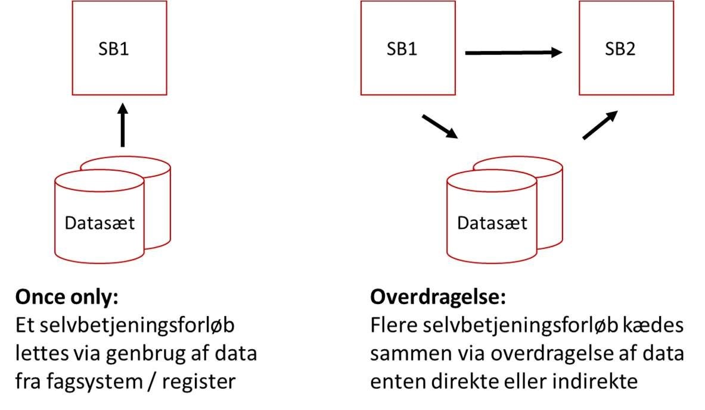

Figur 1 To grundscenarier: Once only og Overdragelse

Denne vejledning viser hvordan data kan genbruges og udveksles på forskellig vis i disse grundscenarier. Til dette er der en række forskellige perspektiver på data, som gør det nødvendigt at kunne tale om data på forskellig måde. Figur 2 giver indledningsvist et overblik over de vigtigste aspekter af dette.

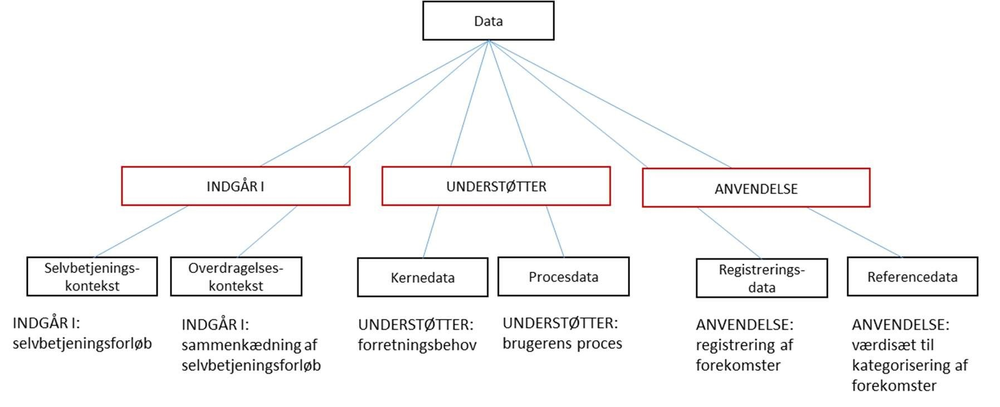

Figur 2 Sammenhæng mellem centrale begreber til beskrivelse once-only og overdragelse

Disse og relaterede begreber beskrives nærmere i det følgende.

Figur 3 viser de fire dele i et selvbetjeningsforløb. RASB folder beskrivelsen af de fire dele ud. Her skal vi blot opsummere, at:

1. **Forberedelsen** hjælper brugeren med at afklare forudsætningerne for at gennemgå det samlede selvbetjeningsforløb med succes samt sikre forventningsafstemning med brugeren om, at de er det rette sted.
2. **Kernen** er den del af forløbet, hvor der typisk indsamles data fra brugeren. Det er i kernen, at brugeren løser sin opgave.
3. **Afrundingen** kvitterer for gennemførsel og fortæller brugeren om konsekvenser og et evt. videre forløb omkring den selvbetjeningsopgave, man netop har været igennem.
4. **Overdragelsen** er en sidste del af selvbetjeningsforløbet, der – hvor det er relevant - etableres en sammenkædning af to eller flere selvbetjeningsløsninger.

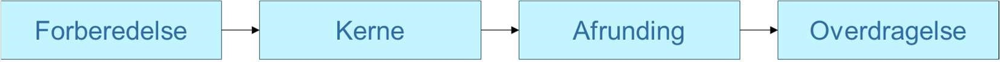

Figur 3: De fire dele i et selvbetjeningsforløb. (Tilpasset fra Referencearkitektur for selvbetjening.)

Andre, væsentlige begreber fra RASB er:

* **Selvbetjeningskæde**, der beskriver et antal selvbetjeningsforløb, kædet sammen gennem overdragelser, der tilsammen løser de opgaver en bruger i en given situation har behov for at løse gennem selvbetjening. En selvbetjeningskæde kan fx være implementeret som en fællesoffentlig løsning i form af en guide, der understøtter en livssituation eller brugerrejse, fx opstart af virksomhed.
* **Selvbetjeningskontekst**, der beskriver relevant information/data, som opsamles fra et selvbetjeningsforløb med henblik på at skabe en sammenhæng for brugeren i et evt. efterfølgende selvbetjeningsforløb. Dækker både relevant og entydig data, som brugeren har indtastet; data der er hentet fra andre systemer (fx grunddata, sagsdata eller data fra en brugerprofil); og procesdata (eksempelvis information om, hvor brugeren kommer fra, hvordan brugeren har gennemløbet selvbetjeningsforløbet, eventuelt inklusive resultatet)
* **Overdragelseskontekst**, som er den delmængde af data fra en Selvbetjeningskontekst, der er relevant for én bestemt, anden selvbetjeningsløsning.

I denne vejledning har vi brug for at folde Overdragelseskontekst ud i to elementer, nemlig:

* **Kernedata**: Den del af en Overdragelseskontekst, der består af indtastet data og som er relevant for Kernen i den modtagende selvbetjeningsløsning – med andre ord, det data, den modtagende løsning har brug for, for at kunne tilbyde brugeren den ønskede service.[\[7\]](#Fodnote7)
* **Procesdata**: Den del af en Overdragelseskontekst, der i relevant omfang beskriver den proces, som brugeren har været igennem i den afgivende selvbetjeningsløsning – med andre ord, data, som kan gøre det muligt for den modtagende løsning at personalisere selvbetjeningsforløbet og lede brugere mere effektivt igennem. For eksempel kan sprogvalg udelades, hvis det allerede er gennemført, eller information om, at man netop har gennemført en bestemt, anden selvbetjeningsløsning, kan bruges til at vise målrettet information, foreslå typiske handlinger, m.m.

En given Overdragelseskontekst mellem to bestemte selvbetjeningsløsninger kan rumme enten relevant delmængde af Kernedata, Procesdata eller begge dele.

Fra RAD anvender vi et par centrale begreber omkring, hvordan data videregives. Disse er:

* **Videregivelse på forespørgsel**: En dataanvender (fx en selvbetjeningsløsning) forespørger på data, der ligger et andet sted, til brug i et igangværende forløb med et givent formål (fx indhentning af data til et selvbetjeningsforløb ud fra once only-princippet)
* **Videregivelse via meddelelse**: Her er det et igangværende forløb, der har brug for at sende data et andet sted hen. For eksempel kunne det være et selvbetjeningsforløb, der har brug for at sende en Overdragelseskontekst til en anden selvbetjeningsløsning.

Til at beskrive data og datahåndtering benytter vi nedenstående begreber, hvoraf flere også er hentet fra RAD:

* **Datasætkatalog**: En fortegnelse over forskellige datasæt, der indeholder en kort beskrivelse af datatypen i datasættet, evt. en reference til en tilhørende datamodel samt evt. en reference til, hvor data kan hentes/tilgås
* Eksempel: Et datasætkatalog rummer en reference til datasættet Danmarks Adresser[\[8\]](#Fodnote8)
* **Datasæt**: En samling af data, der forvaltes under ét
* Eksempel: Danmarks Adresser
* **Type af data**: Benyttes om et forretningsobjekt – den genstand, der beskrives eller refereres til i et datasæt. Bruges for eksempel, når man identificerer databehov
* Eksempel: adressedata (”jeg har brug for data om adresser”)
* **Datamodel**: En veldefineret model, der beskriver attributter og relationer på en given type af data i et bestemt datasæt
* Eksempel: adresser består af ‘vejnavn’, ‘husnummer’ og ‘postnummer'
* **Data**: Information lagret med henblik på (gen-)anvendelse
* Eksempel: Rentemestervej, nummer 8, 2400 København NV
* **Datadistributør**: En organisation/platform, hvis centrale formål at gøre et eller flere datasæt, der evt. kan være ejet af andre myndigheder, tilgængelige til genbrug ved at give anvendere adgang til data via moderne snitflader.

Data findes endvidere i to grundlæggende typer[\[9\]](#Fodnote9):

* **Registreringsdata**, som er en konkret registrering af en forekomst, en observation, en sammenhæng eller lignende[\[10\]](#Fodnote10)
* **Referencedata**, som definerer værdier, der kan anvendes til at kategorisere eller klassificere andre data. Referencedata kan fx anvendes i en selvbetjeningsløsning til at angive mulige værdier, som en bruger kan vælge i en drop down-boks.

Sammenhængen mellem de to typer data er vist i Figur 4

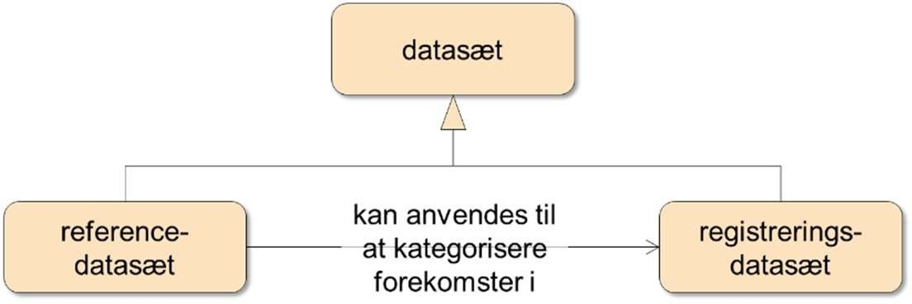

Figur 4: To typer af data, der er relevante for selvbetjeningsløsninger

### Baggrund og formalia for dette dokument

Vejledningen er en del af initiativet _Bedre digital kommunikation_ i _Den fællesoffentlige digitaliseringsstrategi 2016-2020_ og er forankret i Styregruppen for digital kommunikation og er udarbejdet med input fra en arbejdsgruppe bestående af repræsentanter fra KL, Erhvervsstyrelsen, ATP, Udviklings- og forenklingsstyrelsen samt Landbrugsstyrelsen.

## Data du kan genbruge

Dette kapitel gennemgår en metode til at analysere databehovet for en selvbetjeningsløsning med henblik på at understøtte princippet ‘Once-only’ og optimere brugeroplevelsen. De enkelte trin foldes ud og beskrives, særligt omkring identifikation af velegnede datakilder der kan genbruges. Metoden kan benyttes frit til inspiration og som referenceramme, og man kan i det enkelte projekt tilpasse den efter det konkrete behov.

### Analysér og planlæg genbrug af data i løsningen

Der er mange, væsentlige overvejelser, når man som projekt går i gang med at designe eller videreudvikle en selvbetjeningsløsning. Hvordan ser business casen ud? Hvordan skal det grafiske udtryk være? Hvilken tone skal vi lægge i kommunikationen med brugeren? Hvordan styrer vi projektet sikkert i mål? Og ikke mindst: Hvilke data har vi som minimum brug for i selvbetjeningsforløbet for at kunne opfylde løsningens formål?

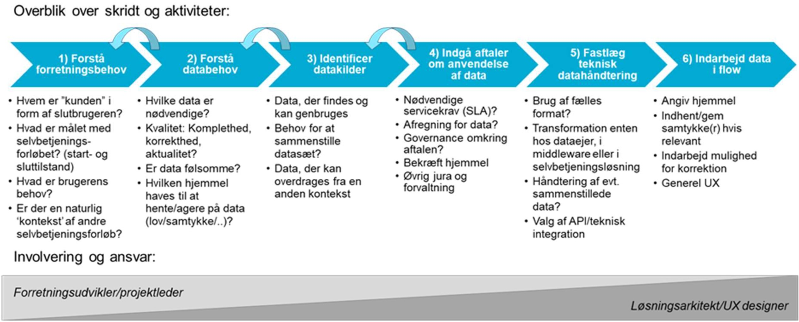

Figur 5 De 6 foreslåede trin i at analysere behovet for data i en selvbetjeningsløsning. Involvering og ansvar skifter fra forretningssiden til den tekniske side i takt med, at analysen skrider frem. Kilde: Projektets analyse.

Figur 5 viser et overblik over de skridt og aktiviteter, der er forbundet med at tilrettelægge genbrug af data ind i en selvbetjeningsløsning. Processen starter ved en forståelse af det forretningsmæssige behov, der skal løses; løber videre over en identifikation af relevante datakilder, afklaring af teknisk integration af data i løsningen og ender i design der sikrer en god brugeroplevelse (UX) særligt i forhold til dialog og datafangst.

De enkelte trin er beskrevet nærmere i de følgende underafsnit.

#### Forstå forretningsbehov

Første skridt er at forstå det forretningsbehov, som selvbetjeningsløsningen skal dække. Skal løsningen give en borger/organisation mulighed for at registrere noget nyt, ændre eksisterende data eller se status på en sag?

I forhold til forretningsbehovet er en effektiv måde at forstå dette på at beskrive starttilstanden (hvad skal der til, for at brugeren er klar til at gå i gang med selvbetjeningsforløbet) og sluttilstanden (hvad er ændret i verden efter gennemførslen af selvbetjeningsforløbet?)

Det er også vigtigt at overveje, om selvbetjeningsforløbet står alene, eller om det typisk gennemføres enten umiddelbart før eller umiddelbart efter andre selvbetjeningsforløb. Denne del kan eksempelvis afklares ved hjælp af servicedesign og/eller ved at analysere kanaldata fra eksisterende selvbetjeningsløsninger. Hvis det sidste er tilfældet, kan der være mulighed for at samle data op fra denne kontekst. Hvis det første er tilfældet kan det alternativt være relevant at overdrage data til andre selvbetjeningsforløb – se Kapitel 4 Genbrug af data i tværgående selvbetjeningsforløb via ”Overdragelse” for en nærmere diskussion af overdragelse).

#### Forstå databehov

Med forretningsbehovet på plads er næste trin at afklare, hvilke _datatyper_ man har behov for, for at kunne gennemføre selvbetjeningsforløbet. Jf. afsnit 2.6 er der to grundlæggende datatyper i spil: Registreringsdata og referencedata, hvor de sidstnævnte ofte vil være mere statiske end de første. De datatyper, der tilsammen er nødvendige for at kunne gennemføre ‘kerne’-delen af selvbetjeningsforløbet, refererer vi til som kernedata – igen jf. afsnit 2.6.

For hver datatype, man har brug for, skal man overveje den _kvalitet_, man ønsker:

* Skal datasættet være komplet, eller kan det bruges, selv om der mangler registreringer?
* Skal den enkelte registrering være fuldstændig, eller kan det accepteres, at nogle af attributterne mangler?
* I hvilken grad skal datasættet være korrekt?
* Hvor ofte ændrer den givne datatype sig – og hvad stiller det af krav til aktualitet?

Er der behov for datasæt med såkaldt dobbelt historik (bitemporalitet), det vil sige, at man kan se, både hvornår data er registeret i it-systemet (registreringstidspunkt), og hvornår data er/var gældende rent forvaltningsmæssigt (gyldighedstidspunkt). I givet fald må man undersøge hvorvidt og hvordan det er muligt at tilvejebringe sådanne data? Desuden skal man tage højde for datas _følsomhed og fortrolighed_. Det omfatter fx klassifikation efter personoplysningers følsomhed, idet der gælder forskellige betingelser og procedurer for behandling af oplysningerne[\[11\]](#Fodnote11). Og tilsvarende klassifikation af grader af fortrolighed forstået som, i hvilket omfang information kan videregives i henhold til sikkerhedscirkulæret (EU/NATO)[\[12\]](#Fodnote12). Dette kan stille store krav til den endelige løsning i forhold til, hvordan data indhentes (fx med/uden eksplicit samtykke) samt til, hvordan det opbevares – både permanent, men også den midlertidige opbevaring, hvor et selvbetjeningsforløb afbrydes midlertidigt og gemmes i selvbetjeningsløsningen med henblik på senere at kunne genoptages. En anden faldgrube er, at følsomme data utilsigtet bliver logget.

En central afklaring er, med hvilken _hjemmel_ man kan indhente data. Nogle data er frit tilgængelige og kan bruges til alle formål, hvorimod andre kræver særlig hjemmel. Identificering af det juridiske grundlag for anvendelse af data er beskrevet i afsnit 3.1.5.

En generel bemærkning er, at det normalt vil være en sund øvelse for et projekt at overveje _forenkling og minimalisme_: Hvor få datatyper og hvor lidt data, man kan nøjes med i det pågældende projekt for at opfylde det forretningsbehov, man skal adressere? En simpel løsning er lettere at implementere og vedligeholde end en kompleks løsning.

#### Identificer datakilder

For hver af de identificerede datatyper begynder nu arbejdet med at lokalisere en datakilde. Ud fra once only-princippet bør man afsøge, om brugeren allerede har afgivet en given type data til det offentlige én gang og at data har samme semantiske indhold hos kilden som de data, aftageren efterspørger – og hvis ja, hvor det så vil kunne findes.

For kernedata er processen for at identificere og afdække datakilder beskrevet i det uddybende afsnit 3.2 Identificer og afklar dine datakilder.

Når denne proces er gennemløbet, vil kernedata fordele sig i tre kategorier:

1. Data, der findes et andet sted, som vurderes som autoritative eller egnede og _kan genbruges,_ men hvor man dog skal afklare, om der skal være mulighed for, at brugeren kan rette data. Hvis autoritative data skal rettes, skal man være opmærksom på at dette skal ske ved kilden, dvs. i kilderegistret.
2. Data, der er unikke for dette selvbetjeningsforløb og dermed _kun kan angives af brugeren._
3. Data, der findes et andet sted, men som vurderes som ikke autoritative eller egnede og som derfor _ikke kan genbruges_[\[13\]](#Fodnote13), og hvor man derfor må bede brugeren angive data igen.

En vigtig pointe er, at det kan være nødvendigt at _sammenstille_ flere forskellige datasæt for at få dækket et identificeret databehov. Det er ikke altid, at behovet for en særlig type af data kan dækkes ved opslag i et enkelt datasæt. Men måske kan det dækkes ved at kombinere flere, separate datasæt.

En anden pointe er, at man i sin dialog med datadistributører og andre dataejere ofte vil støde på datasæt, der _næsten_ dækker behovet. Her kan det være relevant med et tilbageløb til skridt 2 ’Forstå databehov’ for at afklare, om man evt. kan udfordre det databehov, man har identificeret. Måske kan krav til kvalitet sænkes uden nævneværdig konsekvens for løsningen og brugerens oplevelse ved at anvende løsningen? Måske har man fundet en datakilde, der med andre data end dem, man først troede, var nødvendige, på anden vis kan opfylde det forretningsbehov, der blev identificeret i skridt 1?

Endelig bør man afklare, hvordan data, som man har tænkt sig at hente og genbruge i sin selvbetjeningsløsning, kan _rettes_ af brugeren[\[14\]](#Fodnote14), hvis der er _fejl i data_. Som eksempel kan man tage en borgers telefonnummer, som man henter fra et eksternt datasæt. Hvis borgeren har skiftet telefonnummer, skal det naturligvis kunne angives korrekt i selvbetjeningsløsningen – men det vil også være nyttigt at instruere borgeren i, hvor telefonnummeret er hentet fra, hvilken myndighed der er ansvarlig, samt hvordan det kan ændres i det eksterne datasæt[\[15\]](#Fodnote15).

Overvej disse tre muligheder, hvor det kan være relevant at rette fejl i data:

* Hvis det eksterne datasæt tilbyder et _interface_ til ændringer, kan selvbetjeningsløsningen implementere dette.
* Alternativt kan selvbetjeningsløsningen _linke videre_ til en anden selvbetjeningsløsning, som borgeren kan bruge til at opdatere sine data.
* Er dette ikke muligt, bør selvbetjeningsløsningen _informere_ borgeren om, hvor han/hun så kan rette henvendelse.
* Hvis brugerens indtastning af oplysninger, som afviger fra de automatisk indlæste data, kan påvirke den efterfølgende sagsbehandling eksempelvis som følge af, at myndigheden skal berigtige oplysningerne hos den autoritative kilde, bør brugeren oplyses herom. Hvis brugeren forhindres i at fortsætte selvbetjeningsforløbet som følge af, at brugeren indtaster data, der fejler validering op mod den autoritative kilde, vil det i forvaltningsretlig sammenhæng være at opfatte som et afslag[\[16\]](#Fodnote16).

#### Juridisk grundlag for genbrug af data

Når de mulige og relevante datakilder er identificeret, skal projektet sikre sig, at der er juridisk hjemmel til at genbruge de pågældende data. Her er det typisk projektlederen, der sørger for afklaringerne, og det er nødvendigt med bistand til projektet fra en jurist.

Det juridiske grundlag for genbrug af data afhænger af, hvilke formål de konkrete data oprindeligt er indsamlet til, og til hvilket formål data skal anvendes. Det er nødvendigt at afklare dette i samarbejde med en jurist for hvert af de sæt af data, du ønsker at genbruge. **Indholdet i dette afsnit skal derfor læses som en overordnet introduktion til opgaven, og der er tale om en ikke udtømmende oversigt over elementer, du som projektleder skal være opmærksom på.**

Det er Justitsministeriet, der har ressort på databeskyttelsesområdet. Hvis du har konkrete spørgsmål til det juridiske grundlag for genbrug af data, skal du henvende dig til Justitsministeriet/Datatilsynet.Når en offentlig myndighed ønsker at genbruge data i en selvbetjeningsløsning, skal myndigheden kortlægge hvilke oplysninger, der skal behandles og med hvilket formål.

Data fordeles på to hovedgrupper:

* personoplysninger
* andre data end personoplysninger

##### Andre data end personlysninger

Anvendelsen af data, der ikke er personoplysninger, er ikke behæftet med de persondatajuridiske restriktioner, som persondata er. Du skal dog være opmærksom på, at registre med data om eksempelvis materielle enheder eller juridiske personer kan indeholde personoplysninger[\[17\]](#Fodnote17). Hvis du ønsker at genbruge andre data end personlysninger, kan du med fordel finde information herom i EU-forordningen om en ramme for om fri udveksling af andre data end personoplysninger i Den Europæiske Union[\[18\]](#Fodnote18). Du skal desuden være opmærksom på, at anvendelsen af visse typer af data, som ikke indeholder personoplysninger, kan være begrænset af særlove.

##### Hjemmel til genbrug af personoplysninger[\[19\]](#Fodnote19)

Ønsker du at genbruge personoplysninger, skal du kortlægge hvilke personoplysninger, der skal behandles med hvilket formål i den konkrete selvbetjeningsløsning. Denne kortlægning vil medvirke til, at der kan tages stilling til hvilken behandlingshjemmel, der skal danne grundlag for genbrug af de konkrete data i jeres selvbetjeningsløsning.

Behandlingen af persondata kan enten ske i regi af:

* forvaltningsloven eller
* databeskyttelsesforordningen og databeskyttelsesloven

#### Behandling af persondata i regi af forvaltningsloven

Hvis du vil genbruge persondata i en selvbetjeningsløsning, der digitaliserer en proces, hvor en sag rejses ved ansøgning, er genbrug af persondata omfattet af forvaltningsloven.

Ved sager, der rejses ved ansøgning, forstås ansøgninger, hvor der skal træffes en afgørelse. Fx ansøgning om økonomisk støtte hos det offentlige, sager om udstedelse af pas, sager om separation eller skilsmisse. Omfattet af bestemmelsen er blandt andet tilfælde, hvor en person opfordres eller tilskyndes til at bede om en bestemt ydelse.

I sager, der rejses ved ansøgning, skal du være opmærksom på, at oplysninger om ansøgerens rent private forhold som udgangspunkt ikke må indhentes fra andre dele af forvaltningen eller fra en anden forvaltningsmyndighed, medmindre:

1. ansøgeren har samtykket hertil,
2. andet følger af lov eller bestemmelser fastsat i henhold til lov eller,
3. særlige hensyn til ansøgeren eller tredjemand klart overstiger ansøgerens interesse i, at oplysningen ikke indhentes.

Du skal derfor i samarbejde med juristerne foretage en konkret vurdering af, om formålet med den genbrug af data, som du ønsker at foretage i den konkrete selvbetjeningsløsninger, falder ind under en af de tre undtagelser, der er nævnt ovenfor.

Behandling af persondata i regi af databeskyttelsesforordningen og databeskyttelsesloven

Hvis persondata derimod skal genbruges i en selvbetjeningsløsning, som ikke knytter sig til en procedure, hvor der oprettes eller ændres en sag, som skal afgøres, er behandlingen af persondata omfattet af databeskyttelsesforordningen.

##### Forenelighedstest

Du skal i første omgang gennemføre en såkaldt _forenelighedstest_, når jeres behandling af personoplysninger foretages til et andet formål end det indsamlede formål; dog ikke hvis den oprindelige indsamling er baseret på den registreredes samtykke, EU-retten eller national lovgivning. I så fald skal du gå direkte til næste afsnit og læse om, hvilke øvrige muligheder der findes for at sikre hjemmel til behandling af persondata.

Testen anvendes til at afgøre, om behandling til et andet formål er foreneligt med det formål, personoplysninger oprindeligt blev indsamlet til.

I forenelighedstesten skal følgende forhold afgøres:

* forbindelsen mellem det oprindelige formål og formålet med den ønskede viderebehandling
* sammenhængen, hvori personoplysningerne er indsamlet og forholdet mellem den registrerede og den dataansvarlige
* kategorien af personoplysninger, om der er tale om almindelige eller følsomme oplysninger
* de mulige konsekvenser for den registrerede ved viderebehandling af personoplysningerne
* tilstedeværelsen af fornødne garantier såsom kryptering og pseudonymisering

Hvis I på baggrund af forenelighedstesten vurderer, at det nye formål med anvendelsen af de indsamlede data ikke er foreneligt med det oprindelige formål, eller den oprindelige indsamling var baseret på den registreredes samtykke eller et lovkrav, skal du afklare, hvorledes du i stedet kan sikre hjemmel til at genbruge de ønskede persondata.

##### Behandlingshjemmel, hvis nyt formål er uforeneligt med det oprindelige

Under databeskyttelsesforordningen findes tre former for behandlingshjemmel:

* myndighedsudøvelse, herunder gældende lovgivning inden for de områder, der er relevante for den konkrete genbrug af data
* samfundsinteresse
* samtykke

Du skal i samarbejde med juristerne og de forretningsansvarlige afklare, hvilken hjemmel der er den relevante.

Hvis I anvender samtykke som hjemmel, skal I desuden være opmærksomme på de særlige krav, som databeskyttelsesforordningen stiller hertil. Du kan læse mere herom i Datatilsynets vejledning om samtykke[\[20\]](#Fodnote20).

Ved behandling af personoplysninger er det ligeledes vigtigt at afklare, om der er tale om almindelige personoplysninger eller følsomme personoplysninger[\[21\]](#Fodnote21), idet der stilles særlige krav ved behandlingen af sidstnævnte.

Ved videregivelse af borgerens data fra den afgivende myndighed til den modtagende myndighed, skal den afgivende myndighed ligeledes sikre, at der foreligger et hjemmelsgrundlag for videregivelse (medmindre videreanvendelse af data er foreneligt med indsamlingsformålet).

Hvis myndighedsudøvelse ikke umiddelbart kan anvendes som hjemmel, er behandlingen ikke nødvendigvis udelukket. Databeskyttelsesloven[\[22\]](#Fodnote22) giver offentlige myndigheder mulighed for at viderebehandle personoplysninger til andre formål, end det de oprindelige var indsamlet til uafhængigt af formålenes forenelighed. Det kræver dog, at ministeren, som er ansvarlig for den lovgivning, der regulerer indsamlingen af personoplysningerne og som ønsker de indsamlede personoplysninger genbrugt til et andet formål forhandler herom med justitsministeren.

##### Dataansvar

Den modtagende myndighed skal desuden være opmærksom på, at denne påtager sig rollen som selvstændig dataansvarlig, når den behandler de modtagende personoplysninger fra den afgivende myndighed til sit eget formål.

##### Oplysningspligt

Både ved once-only og overdragelse af data mellem selvbetjeningsløsninger skal du være opmærksom på oplysningspligten. Ved once-only, hvor data hentes fra et register, skal myndigheden i selvbetjeningsløsningen oplyse brugeren om, hvorfra oplysningerne er hentet.

Ved overdragelse af data mellem selvbetjeningsløsninger skal den afgivende myndighed være opmærksom, at myndigheden har pligt til _blandt andet_ at oplyse brugeren om formålet med behandlingen, hvem der er dataansvarlig for behandlingen og om hvorvidt personoplysningerne videregives[\[23\]](#Fodnote23). Den modtagende myndighed skal ligeledes opfylde sin oplysningspligt, som både omfatter de oplysninger, der er hentet fra den afgivende myndighed/selvbetjeningsløsning og de nye oplysninger, som brugeren eventuelt selv har suppleret med i den modtagende selvbetjeningsløsning. 

#### Indgå aftaler om anvendelse af data

Når det er sikret, at der er hjemmel til at genbruge de ønskede data, skal projektlederen sørge for at få indgået øvrige nødvendige aftaler om anvendelse af data. Også her er det typisk projektlederen, der driver afklaringerne, og ofte er det nødvendigt med bistand til projektet fra en jurist.

Afhængig af datas karakter kan der være forskellige måder at sikre sig adgang til data på. For åbne data, der er stillet bredt til rådighed, kan det være nok at leve op til de angivne vilkår[\[24\]](#Fodnote24). I andre tilfælde skal der indgås en særlig aftale enten med den dataansvarlige myndighed eller med den datadistributør, der varetager opgaven med at udstille det pågældende datasæt.

Det falder uden for denne vejledning at lave en fuldstændig afdækning af, hvad en aftale skal indeholde og hvordan, den indgås. Nedenfor er listet nogle af de typiske elementer, der indgår i aftaler om genbrug af data. Afhængigt af den specifikke brug, karakteren af data, hvilket domæne data stammer fra osv., kan der være yderligere krav og aspekter, der skal dækkes ind.

##### Typiske elementer i aftale om genbrug af data:

1. Datamæssigt indhold kan inkludere:
   1. Regulering af datas anvendelse – herunder om data må benyttes til andre formål end det aktuelle selvbetjeningsforløb, om data må overgives til tredjemand, m.m. jf. afsnit 3.1.4
   2. Eventuelt krav til logning af anvendelse af data og deling af logdata
   3. Hvilken kvalitet skal data have? Hvem er ansvarlig ved fejl/mangler i data?
   4. Instruktion om transformation af data, herunder brugervendte labels
   5. Krav om oplysninger vedrørende konstaterede fejl i data?
   6. Krav om oplysning til dataejer ved mistanke om eller konstateret misbrug/sikkerhedsbrist omkring data
   7. Angivelse af hjemmel ved anvendelse af data
   8. Øvrige, relevante aspekter fra en databehandleraftale (jf. databeskyttelsesloven), såfremt der behandles/genbruges personoplysninger jf. 3.1.4
2. Teknisk indhold kan inkludere:
   1. Hvilke tekniske integrationsstandarder må anvendes?
   2. Hvilken bruger-/rettighedsstyring skal anvendes?
   3. Krav til at anvende (fællesoffentlige) referencedata, dvs. kontrollerede værdilister for datafelter (taksonomier)?
   4. Hvilken part er ansvarlig for at transformere data til ønsket slutformat?
   5. Krav i forbindelse med versionering af service/dataformater (fx midlertidig paralleldrift)
   6. Krav til sikkerhed i lagring og transport af data?
   7. Krav om monitorering/statusservice, der oplyser om dataservicens aktuelle tilgængelighed
   8. Hvilke _Service Level_\-krav (SLA) er væsentlige – herunder krav til oppetid, svartid, _recovery time_, datamængder, peak-belastninger m.m.
3. Kommercielt og brugsmæssigt indhold kan inkludere:
   1. Evt. regler/model for afregning for brug af data
   2. Evt. regler for _fair use_
   3. Evt. regler for kompensation ved fejl, nedetid m.m.
   4. Evt. regler, der begrænser mulighed for videresalg af data
   5. Krav om og omfang af teknisk support. Hvem kontaktes for afklaringer, i fejlsituationer, ved behov for eskalering m.m.?
   6. Evt. krav til servicevinduer og tilhørende varsling

#### Fastlæg teknisk datahåndtering

I forhold til håndtering af data skal flere aspekter afklares, hvilket typisk vil være drevet af projektets arkitekt. Til en start skal der skabes overblik over anvendelse i selvbetjeningsløsningen og over datamodeller og formater for de data, der skal genbruges fra andre løsninger, herunder data udstillet af andre myndigheder. I det simple tilfælde kan selvbetjeningsløsningen _anvende data direkte_. I andre tilfælde vil der være behov for at _transformere data_ via mapning mellem forskellige logiske datamodeller (fx for at omstrukturere eller reducere i data) og/eller fysiske dataformater (fx mellem JSON og XML – se Figur 6 for et eksempel).

##### XML

```
<person>
 <navn>Ane Andersen</navn>
  <adresse>
   <vej>Applebys Plads 7</vej>
   <by>København K</by>
   <postnummer>1411</postnummer>
  </adresse>
 <profession>IT-arkitekt</profession>
</person>
```

##### JSON

```
{
 "person": {
  "navn": "Ane Andersen",
   "adresse": {
    "vej": "Applebys Plads 7",
    "by": "København K",
    "postnummer": "1411"
   },
  "profession": "IT-arkitekt"
 }
}
```

Figur 6: Eksempel på forskellige dataformater – XML over for JSON. Datamodellen i de to eksempler er her ens. Man kunne dog forestille sig forskellige datamodeller/strukturer, der også skulle håndteres i en transformation – fx kunne persondata være registreret som et underelement ’beboer’ til adresse-elementet.

Projektet skal afklare, _hvor_ – og af _hvem_ - en evt. transformation skal foretages. Dette er hovedsageligt en teknisk afgørelse og er påvirket dels af den tekniske arkitektur omkring løsningen, dels af eventuelle krav om brug af fælles standarder inden for et givet domæne, m.m. Men man skal være opmærksom på, at der kan være væsentlige forretningsmæssige, semantiske og juridiske forhold, som gør at det er vigtigt at afklare hvem der har _ansvaret for transformationen_, og om der eventuelt skal indgå en instruks om transformation i en databehandleraftale. Dette omfatter også håndteringen af navne på dataobjektets egenskaber, der skal transformeres til et brugervendt sprog (labels).

Der er i grundsituationen to muligheder for at placere transformationen, jf. Figur 7. Man kan enten lade datadistributør/dataejer implementere transformationen og udstille en service, der tilbyder data i det ønskede format. Dette er en god løsning, hvis man forventer, at den nye service har potentiale for genbrug. Alternativt kan selvbetjeningsløsningen benytte en eksisterende service og selv stå for at transformere data. Herved er der fuld fleksibilitet, men mindre potentiale for genbrug af data i det anvendelsesorienterede format. Andre løsninger med samme behov vil skulle implementere lignende transformationer separat.

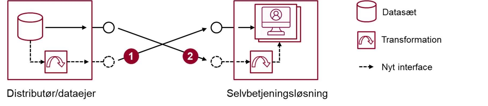

Figur 7: To grundlæggende muligheder for at transformere data. Mulighed 1 indebærer, at distributøren/dataejeren transformerer og udstiller data i et anvendelsesorienteret format, der kan benyttes direkte af selvbetjeningsløsningen. Mulighed 2 indebærer, at den aftagende selvbetjeningsløsning anvender en eksisterende service og selv transformerer data til det ønskede format.

En anden, typisk situation er, at der ligger en integrationskomponent (_middleware)_ mellem datasættet og selvbetjeningsløsningen[\[25\]](#Fodnote25). En sådan komponent kan virke som en _service bus_ og kan fx stå for transformationer. Komponenten kan også tilbyde aggregerede services, der sammenstiller data fra flere forskellige kilder og udstiller én service målrettet den anvendende selvbetjeningsløsning. Derved kan en integrationskomponent benyttes til at få en lang række systemer, med behov for de samme data i forskellige formater, til at hænge sammen.

Omvendt kan en integrationskomponent også benyttes til at håndhæve et evt. krav inden for en organisation eller inden for et domæne om, at der anvendes en fælles standard for dataudvekslingsformater[\[26\]](#Fodnote26). Derved motiveres de omkringliggende løsninger til at anvende samme standard, hvilket alt andet lige er fornuftigt i forhold til fremtidigt genbrug og vedligehold. Figur 8 skitserer, hvordan en integrationskomponent kan benyttes til transformationer samt sammenstilling af data.

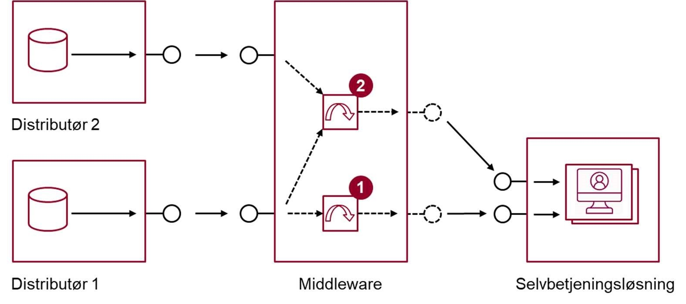

Figur 8: Skitse af, hvordan en middleware-platform/integrationskomponent kan 1) implementere transformation mellem dataformater og/eller 2) sammenstille data fra forskellige kilder til en ny, anvendelsesorienteret service målrettet selvbetjeningsløsningen.

En del af den tekniske håndtering af data er at vælge et velegnet _integrationsmønster_. En selvbetjeningsløsning bør, når den henter data fra andre systemer, benytte sig af et _request/response_\-mønster. Denne vejledning folder ikke valget yderligere ud, men konstaterer blot, at der blandt datadistributionsplatforme er to fremherskende protokoller, nemlig web services baseret enten på SOAP eller REST. SOAP kræver, at data formateres som XML. Mange selvbetjeningsløsninger benytter i dag i høj grad javascript til at kontrollere brugerinterfacet. Håndtering af XML i javascript kan være tungt, og derfor er JSON[\[27\]](#Fodnote27) over REST-protokollen et populært alternativ. Som del af den fællesoffentlige digitale arkitektur er der udarbejdet et sæt [retningslinjer for webservices](https://arkitektur.digst.dk/node/537) med brug af REST.

Et mønster, der tidligere har været anvendt bredt, er at etablere og anvende _lokale kopier_ af datasæt. En myndighed, der er ansvarlig for en selvbetjeningsløsning, der afhænger af en anden myndigheds data, kan vælge at kopiere hele datasættet over, hvorved man får øget kontrol over tilgængelighed, performance, dataformater (man kan lave de nødvendige transformationer i forbindelse med kopieringen), m.m.[\[29\]](#Fodnote29) Ulempen ved dette mønster er dog, at det introducerer en del teknisk kompleksitet i forhold til at holde datasætkopien opdateret. Oveni opstår der forretningsmæssig kompleksitet i, at det bliver vanskeligt at vide, hvorvidt data i datasætkopien er aktuelle, eller om de kan være blevet ændret eller slettet i det bagvedliggende, autoritative datasæt, ligesom det bliver vanskeligere for den dataansvarlige myndighed at holde styr på, hvor data befinder sig og hvad data bruges til, hvilket er et GDPR-krav. Den øgede kompleksitet gør, at mønsteret med datasætkopier generelt set ikke anbefales[\[30\]](#Fodnote30).

En sidste kommentar angår _versionering_ af services. Det kan sagtens ske, at man i skridt 3 ”Identificer datakilder” finder en eksisterende service, der næsten opfylder det databehov, der blev identificeret i skridt 2 ”Forstå databehov”, men måske mangler en enkelt attribut for at være anvendelig. I stedet for at designe en helt ny service er det her relevant at gå i dialog med datadistributøren om muligheden for at tilføje dette felt til den eksisterende service. Dette kræver i praksis, at servicen versioneres, så den eksisterende service kører videre med det eksisterende format (for at undgå at påvirke andre applikationer, der er afhængige af det eksisterende format), men at man samtidig parallelt med denne version 1.0 udstiller en version 1.1 af servicen, hvor det ønskede felt er tilføjet. Brug af versionering giver fleksibilitet, men kan også drive kompleksitet og dermed omkostninger over tid.

#### Indarbejd data i flow

Sidste skridt i modellen er at få den data, der indhentes ud fra once only-princippet, godt indarbejdet i selvbetjeningsforløbet, så løsningen ender med at være brugervenlig og give brugeren en god oplevelse. Her kan et projekt med fordel trække på en UX-designer[\[31\]](#Fodnote31). Vi fokuserer i dette underafsnit på det datamæssige perspektiv og forholder os ikke til andre aspekter, der påvirker brugerens oplevelse, så som det grafiske design, sideopbygning, kommunikationsstil, o.m.m.

Hvis det er nødvendigt at indhente samtykke fra brugeren for at sikre hjemmel til behandling af persondata, skal dette gøres i overensstemmelse med de gældende retningslinjer, se eventuelt afsnit 3.1.5.

Når den enkelte datatype er hentet, er der tre grundlæggende måder at benytte den på:

1. _Skjult_: Selvbetjeningsløsningen tilpasser sig efter data, men viser i øvrigt ikke data til brugeren
   * Dette kan være relevant fx ved data, der relaterer sig til konteksten, fx om brugeren kommer direkte fra et andet selvbetjeningsforløb – se afsnit 2.6 for diskussion
2. _Read-only_: Feltet, der er blevet forudfyldt med data, kan ses, men ikke ændres
   * Kan være relevant, hvis data hentes fra et autoritativt register og dermed ikke bør ændres[\[32\]](#Fodnote32)
3. _Åben_: Feltet, der er blevet forudfyldt med data, kan ændres
   * Kan være relevant, hvis der hentes information fra et ikke-autoritativt datasæt

I både tilfælde 2 og 3 bør man som princip _gøre kilden synlig_ for brugeren, så brugeren ved fra hvilken myndighed og eventuelt fra hvilken konkret kilde (fx CPR-registret eller eIndkomst), data er hentet.[\[33\]](#Fodnote33)

Ligeledes af princip bør man gøre det klart for brugeren, hvordan det er muligt at _opdatere eller rette_ de pågældende data, hvis de er forældede, ukomplette eller ukorrekte. Særligt i tilfælde hvor datakilden ikke er autoritativ i forhold til formålet kan dette være relevant. Løsningen kan enten tilbyde at videregive de opdaterede informationer til det datasæt, hvorfra de ukomplette data stammer – såfremt den ansvarlige myndighed har stillet et interface til rådighed for dette. Alternativt må brugeren informeres om, hvordan data kan rettes.

En konkret overvejelse, der er særlig relevant, hvis der skal hentes data fra services med lang svartid, er anvendelsen af _lazy load_. Dette dækker over, at selvbetjeningsløsningen ikke afventer, at al data er hentet, inden siden vises til brugeren. I stedet vises en side til brugeren, hvor enkelte felter ikke er udfyldt, men i stedet fx er dækket af en ’spinner’, mens data hentes asynkront.

### Identificer og afklar dine datakilder

I modellen for dataanalyse, jf. ovenstående Figur 5, er trin 3 ”Identificer datakilder”. I dette trin skal projektet identificere en konkret datakilde, der kan genbruges. Denne proces er ikke triviel og indebærer ofte en del overvejelser, afvejninger og tilbageløb. I dette afsnit går vi i detaljer med, hvordan man i et projekt kan identificere og udvælge en datakilde.

#### Spørgetræ for datakildeidentifikation

Der er mange spørgsmål, der skal overvejes, når behovet for en bestemt type data skal dækkes af en given datakilde. Figur 9 nedenfor forsøger at strukturere disse spørgsmål i et spørgetræ, der giver en vej igennem afklaringerne.

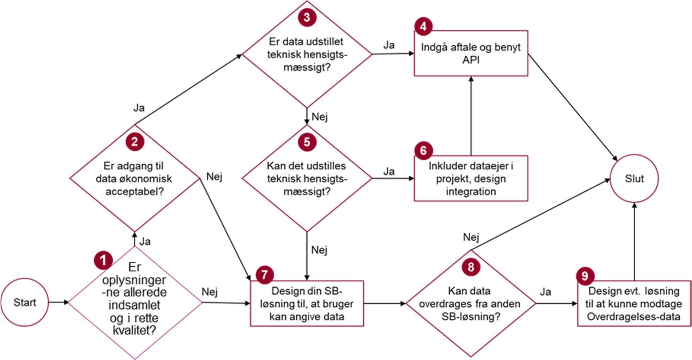

Figur 9: Spørgetræ, der gennemgås for hver datatype med henblik på at identificere en egnet datakilde

Nedenfor gennemgås de enkelte trin i spørgetræet.

1. **Findes datatypen autoritativt/centralt og i rette kvalitet?** Nogle datatyper befinder sig i forvejen i et centralt register, fx CPR-data og mange data på erhvervsområdet. Der kan være autoritative krav (fx i lovgivning) om, at sådanne data skal genbruges, og data vil da typisk allerede være udstillet af dataejer, evt. gennem en datadistributør. Andre datatyper har måske ikke autoritative datakilder, men har alligevel en ”naturlig” placering hos en bestemt myndighed. Brug af et datasætkatalog (se afsnit 3.3) er ofte et godt udgangspunkt for at identificere datakilde-kandidater. Som en del af datasættets beskrivelse vil man eventuelt kunne finde en beskrivelse af datakvaliteten, som kan anvendes om udgangspunkt for en vurdering i forhold til de krav, som blev identificeret i trin 2 ’Forstå databehov’ (se underafsnit 3.1.2). Endvidere er det vigtigt at sikre sig, at data har samme semantiske indhold i datasættet som i de data, der skal afleveres i den konkrete selvbetjeningsløsning.
2. **Er adgang til data økonomisk acceptabel?** I dag er mange datatyper stillet gratis til rådighed for genbrug, fx via Datafordeleren. Andre datatyper indsamles og opbevares hos den pågældende myndighed, og her kan der være en pris på at genanvende eksisterende snitflader til at hente data. Såfremt, der er tale om en datakilde, der for den aktuelle selvbetjeningssammenhæng skal bruges (er autoritativ), bør denne omkostning være indregnet i projektgrundlaget. Hvis datakilden ikke er autoritativ, må projektet overveje, om prisen for at tilgå data er acceptabel – eller om projektet i stedet må overveje alternative datakilder, der har lavere omkostninger, hvis de også kan dække det identificerede behov – evt. via sammenstilling af flere datasæt.
3. **Er data udstillet teknisk hensigtsmæssigt?** I selvbetjeningssammenhæng er det stort set et krav, at data er udstillet via integrationsmønsteret ’request-response’ for at være teknisk hensigtsmæssigt. Dette mønster tillader indhentning af data ved behov, hvilket netop er det, der er brug for, for at kunne forudfylde felter i et selvbetjeningsforløb. Dernæst kan der være ikke-funktionelle, tekniske krav. Fx skal de fleste selvbetjeningsløsninger fungere 24-7, hvilket betyder, at de underliggende datakilder bør have en tilsvarende oppetid. Omkring svartid bør en side blive vist til brugeren på 1-2 sekunder for at understøtte en god brugeroplevelse, og da dette kan indebære, at flere dataservices skal kaldes enten parallelt eller serielt, stiller det krav til svartid på datakilden. Datamængder kan også være en svartids-udfordring i nogle sammenhænge; et eksempel kunne være en selvbetjeningsløsning, der har brug for at trække på højopløselige satellitfotos. Endelig skal krav til performance (håndtering af mange, samtidige brugere) afklares, hvilket er særlig relevant, hvis selvbetjeningsløsningen forventes at have klare spidsbelastningssituationer.
4. **Indgå aftale og benyt API.** I de fleste situationer vil det være en fordel at indgå en aftale med dataejer/datadistributør omkring brug af data med en given snitflade/API som datakilde. Selv, hvis data er gjort frit tilgængelige, er en vis form for registrering hos dataejeren/-distributøren normalt altid påkrævet for at sikre, at denne kender til den pågældende anvendelse, man er ved at designe. Dette har betydning for dataejerens/-distributørens styring både af driftsmæssige forhold (fx varsling om nedetid), men også _service lifecycle management_ i et bredere perspektiv (fx varsling om versionering af services eller om opgraderinger af tekniske komponenter fx relateret til sikkerhed/brugerstyring, m.m.) Se i øvrigt underafsnit 3.1.5 for yderligere diskussion omkring aftaler.
5. **Kan data udstilles teknisk hensigtsmæssigt?** Hvis projektet identificerer en datatype, der er velegnet til genbrug, men som ikke er gjort tilgængelig på en hensigtsmæssig måde, kan det være en mulighed at lade det indgå i projektet at få data gjort tilgængeligt. Der kan være mange barrierer i at få dette til at ske, fx: Hvem betaler? Er de nødvendige ressourcer hos dataejer tilgængelige? Kan timingen passe med projektets øvrige deadlines?
6. **Inkluder dataejer i projekt, design integration.** Hænger i praksis tæt sammen med punkt 5. I forhold til det tekniske design vil det relevante integrationsmønster næsten altid være request-response, implementeret på en moderne web service-baseret teknologi.
7. **Design din selvbetjeningsløsning til, at bruger kan angive data.** Brugeren skal selv kunne indtaste de data, som ikke kan hentes fra en datakilde af en grund som er afdækket i de foregående trin.
8. **Kan data overdrages fra anden selvbetjeningsløsning?**[\[34\]](#Fodnote34) For at skabe sammenhængende, offentlige løsninger, kan der være situationer, hvor det giver mening at koble to selvstændige selvbetjeningsløsninger gennem princippet Overdragelse. Projektet skal afgøre, om det for den selvbetjeningsløsning, man designer, er relevant at overveje Overdragelse fra eller til andre løsninger.
9. **Design evt. løsning til at kunne modtage Overdragelses-data.** Hvis Overdragelse er potentielt muligt for den givne løsning, kan projektet analysere, om det også i praksis er fordelagtigt at implementere understøttelse af, at en anden, forudgående selvbetjeningsløsning kan overdrage data til den selvbetjeningsløsning, projektet er ved at designe. Se kapitel 4 for yderligere diskussion af muligheder, fordele og ulemper ved Overdragelse.

#### Oversigt over forskellige, bredt anvendte datakilder

Der eksisterer en række offentlige datadistributionsplatforme, der har til formål at gøre offentlige data tilgængelige for genbrug. Tabel 2 giver en kort oversigt over en række af de væsentligste.

|     |     |     |     |
| --- | --- | --- | --- |Tabel 2: Oversigt over en række offentlige datadistributionsløsninger. Baseret på oversigt i: ”_Dokumentation af den danske offentlige sektors datainfrastruktur”, intern DIGST-rapport, februar 2018_
| Datadistributionsplatform | Myndighed | Beskrivelse | Link |
| --- | --- | --- | --- |
| Danmarks Miljøportal | Danmarks Miljøportal | Opsamler, opbevarer og udstiller natur- og miljødata | [Danmarks miljøportal](http://www.miljoeportal.dk/) |
| Datafordeleren | Styrelsen for Dataforsyning og Effektivisering | Distribuerer fællesoffentlige grunddata via en række webservices, filbaserede udtræk og hændelsesbeskeder | [Datafordeler](https://datafordeler.dk/) |
| Den Nationale Serviceplatform (NSP) | Sundhedsdatastyrelsen | Understøtter datadeling mellem en lang række digitale løsninger, der benyttes af borgere, patienter og medarbejdere i hele sundhedsvæsenet | [Sundhedsstyrelsen: Den nationale serviceplatform](https://sundhedsdatastyrelsen.dk/NSP) |
| Det Fælles Datagrundlag (DFDG) | Styrelsen for Arbejdsmarked og Rekruttering | Understøtter deling af nødvendige oplysninger på beskæftigelsesområdet på tværs af relevante parter, herunder jobcentre, a-kasser, borgere og andre aktører | [Styrelsen for arbejdsmarked og rekruttering: Det fælles datagrundlag](https://star.dk/it/saadan-arbejder-vi-med-it-i-styrelsen/oversigt-over-digitale-platforme-for-eksterne-brugere/styrelsen-for-arbejdsmarked-og-rekrutterings-webservices-og-wiki/webservices-til-dfdg-det-faelles-datagrundlag/) |
| ERST Distribution | Erhvervsstyrelsen | Distribuerer CVR data og andre erhvervsdata fra Erhvervsstyrelsen, beriget med virksomhedsrelaterede data fra andre offentlige datakilder | [Virk](https://data.virk.dk/)<br><br>[Erhvervsstyrelsens System til system-adgang til CVR-data](https://datacvr.virk.dk/artikel/system-til-system-adgang-til-cvr-data) |
| Generel UdstillingsLøsning (GUL) | SKAT | Skal efter planen tilbyde én fælles, ensartet og stabil indgang til SKATs data | (Under udvikling) |
| Kortforsyningen | Styrelsen for Dataforsyning og Effektivisering | Distribution af kort og geodata på internettet. | [Kortforsyningen](https://kortforsyningen.dk/) |
| Energi Data Service | Energinet (Energi-, Forsynings- og Klimaministeriet) | Gratis og åben dataportal, hvor alle kan hente data om det danske energisystem – fx CO2-udledning og forbrugs- og produktionsdata. | [Energidataservice](https://www.energidataservice.dk/da_DK/about) |
| Serviceplatformen og de fælleskommunale støttesystemer | KOMBIT | Giver adgang til, at kommuner og kommunale it-leverandører på en ensartet måde kan få adgang til funktionalitet og data fra offentlige fag- og kildesystemer | [Den kommunale serviceplatform](https://www.serviceplatformen.dk/) |
| Statistikbanken | Danmarks Statistik | Indeholder og udstiller officiel statistik, der beskriver det danske samfund | [Statistikbanken](http://www.statistikbanken.dk/) |

Listen er ikke udtømmende, men rummer platforme, der distribuerer en række af de datatyper, der ofte vil være brug for at inkludere i selvbetjeningsløsninger. [Listen over datadistributører](https://arkitektur.digst.dk/node/677) opdateres løbende på FDA-hjemmesiden.

### Anvend datasætkataloger hvis muligt

Datavejviser har til formål at samle metadata om datasæt på tværs af den offentlige sektor. Det skal give overblik over hvilke offentlige datasæt, der findes, hvor de findes, og om de er tilgængelige. For hvert datasæt kan der være metadata om fx ejer, kilde, datamodel, kvalitet (komplethed, korrekthed, aktualitet og genbrugelighed/forståelighed), kontaktinformation m.m. Kataloget er bl.a. forberedt til at kunne kategorisere datasæt i forhold til offentlige opgaveområder med FORM-koder, hvilket kan lette søgningen i forhold til et specifikt formål.

Der findes desuden en række datasætkataloger, der dækker forskellige domæner. Listen inkluderer bl.a.:

* Erhvervsstyrelsens datakatalog[\[37\]](#Fodnote37). Giver et overblik over offentlige, erhvervsrelevante data. Erhvervsstyrelsen vedligeholder desuden en oversigt over udvalgte, offentligt tilgængelige data inklusive inspiration til, hvordan de kan anvendes. Beskriver bl.a. adressedata (DAWA), geodata, virksomhedsdata, kriminalstatistikregisteret, PEP-liste (Politically Exposed Persons) m.m.[\[38\]](#Fodnote38)
* Geodata-info: Giver et overblik over geodata-datasæt omfattet af EU’s INSPIRE-direktiv. Vedligeholdes af SDFE.[\[40\]](#Fodnote40)
* Open Data DK: Samler en lang række åbne datasæt, bl.a. fra flere af landets kommuner.[\[41\]](#Fodnote41)
* Sundhedsdatastyrelsen vedligeholder et overblik over registre og services, der indeholder data bl.a. om behandlinger i sundhedsvæsenet, danskernes sundhed og forbrug af medicin.[\[42\]](#Fodnote42)
* Rigsarkivets Daisy-system: En række myndigheder er forpligtede til at arkivere informationer hos Rigsarkivet, herunder digitale fortegnelser (sagsbærende systemer, ansøgninger m.m.) En søgning på emneord kan give fingerpeg om, hvorvidt der findes datasæt relateret til et givent område, samt hvilken myndighed, der er ansvarlig. – sagsbærende systemer, ansøgninger m.m.[\[43\]](#Fodnote43)

Flere af de datadistributionsplatforme, der er nævnt i Tabel 2, har også datasætkataloger indbygget.

### Datasikkerhed

Sikker håndtering af data har både et teknisk og et forretnings- og designmæssigt element. Det tekniske element, som dækker fx kryptering af data både i forbindelse med videregivelse og i forbindelse med lagring, er ofte implementerings- og teknologinært og foldes ikke yderligere ud i denne vejledning.

På det forretningsmæssige plan skal _datasikkerhed altid tænkes ind i designet_ – særligt, hvor der er tale om personhenførbare data, og hvor GDPR-lovgivningen dermed har effekt. GDPR taler om ”Security/Privacy by design”. En generel rettesnor er, at jo færre data, der er behov for at efterspørge i et selvbetjeningsforløb, og jo kortere tid, løsningen skal være ansvarlig for at holde data, desto færre risici.

I forhold til, hvordan data fra et specifikt datasæt skal håndteres i forbindelse med genbrug, opererer mange myndigheder med princippet ”_sikkerheden følger data_”. Dette dækker over, at en selvbetjeningsløsning, der genbruger data fra et specifikt datasæt, skal _implementere mindst samme sikkerhed_ omkring brug/lagring af og adgang til data, som datakilden og den bagvedliggende dataejer foreskriver.

En konkret designovervejelse for et projekt kan være, at man i specifikke situationer kan _undlade at hente data_ og i stedet _anvende en forretningsservice_. Som eksempel kan en selvbetjeningsløsning have behov for at afgøre, om en borger er myndig. Dette kan implementeres ved, at løsningen indhenter data om borgerens alder for at afgøre, om borgeren er over 18 år gammel. Dette medfører imidlertid, at løsningen nu er i besiddelse af personoplysninger data om borgerens alder. Alternativt kunne løsningen forespørge på en ekstern service, der blot returnerer sandt/falsk i forhold til, om borgeren er myndig – uden at returnere borgerens alder.[\[44\]](#Fodnote44) Dermed er der færre data at holde styr på i selvbetjeningsløsningen – et eksempel på ”security/privacy by design”.

Et konkret checkpunkt er at _sikre, at data ikke logges utilsigtet_ i logs målrettet driftsovervågning, teknisk opfølgning, afregning, compliance eller andre formål. Hvis det er nødvendigt at logge data, følger det af princippet om ”sikkerhed følger data”, at sikkerhed omkring loggen som minimum skal leve op til de sikkerhedskrav, der stilles fra dataejer, ud fra en _end to end_\-betragtning af datas videregivelse.

## Genbrug af data i tværgående selvbetjeningsforløb via ”Overdragelse”

Dette kapitel folder princippet ’Overdragelse’ ud med henblik på i højere grad at understøtte tværgående brugerrejser.  

Vi ser på, hvordan data i en overdragelseskontekst kan benyttes til at forudfylde datafelter, tilpasse flowet til den aktuelle sammenhæng, mm, og vi diskuterer en række centrale perspektiver i forhold til at anvende Overdragelse.

I Bilag B præsenteres forskellige mønstre for, hvordan Overdragelse kan implementeres.

Indledningsvist er det imidlertid vigtigt at understrege, at ’overdragelse’ er et relativt nyt koncept inden for offentlig digitalisering, og at der kun er gjort relativt få praktiske erfaringer med en egentlig implementering af overdragelse mellem to selvbetjeningsløsninger. Der kan være situationer, hvor det giver mening og hvor man kan kontrollere kompleksiteten. I andre situationer vil det omvendt kunne øge kompleksiteten betydeligt, så merværdien ikke står mål med risici. Derfor anbefales det heller ikke som en generel kapabilitet, men som en mulighed, der skal vurderes i en konkret kontekst af to eller flere selvbetjeningsløsninger.

### Overdragelse kan understøtte tværgående brugerrejser

Tanken bag begrebet ’Overdragelse’, der blev introduceret i Referencearkitektur for selvbetjening tidligere i 2018, er at understøtte sammenhængende brugerrejser. Overdragelse er et koncept, der beskriver evnen, at en selvbetjeningsløsning kan videregive data til en anden. Formålet hermed er at medvirke til, at en bruger oplever sammenhæng på tværs af ellers adskilte selvbetjeningsforløb. Når overdragelse anvendes, opstår der en selvbetjeningskæde af afgivende og modtagende forløb.

En selvbetjeningsløsning kan altså betragtes ud fra to perspektiver: Både som en isoleret løsning, og som en del af en (eller flere) tværgående brugerrejser. Figur 10 illustrerer dette.

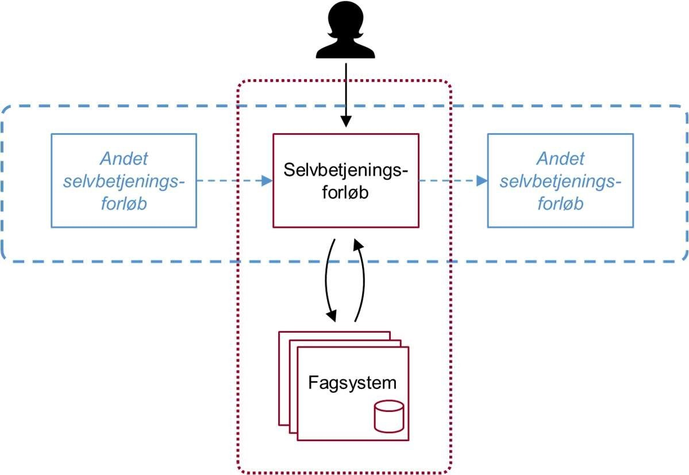

Figur 10: To perspektiver på et selvbetjeningsforløb: Både et isoleret forløb (rød, prikket kasse) og en potentiel del af en tværgående brugerrejse (blå, stiplet boks), hvor andre selvbetjeningsløsninger kan komme enten før eller efter. De blå, stiplede pile indikerer mulighed for Overdragelse.

Fordelen ved overdragelse er, at de modtagende forløb

* kan undgå dobbeltindtastninger af de samme data fra brugeren
* kan bruge brugerens forudgående kontekst til forenkling og personalisering.

Det er imidlertid vigtigt at understrege, at etablering af overdragelse mellem to eller flere selvbetjeningsløsninger forudsætter, at de konkrete selvbetjeningsløsninger indgår i en veldefineret brugerrejse.

Et eksempel på ’overdragelse’ er, at en bruger i forbindelse med livssituationen ’luk virksomhed’ kan have behov for at benytte mere end én selvbetjeningsløsning som led i den samlede brugerrejse. Brugerrejsens startsituation er virksomhedsejeres beslutning om at lukke sin virksomhed – og dens slutsituation er, at lukningen er gennemført og alle dertil hørende opgaver og aktiviteter ift. offentlige registreringer og selvbetjening er fuldført. Foruden Erhvervsstyrelsens løsning ’Luk virksomhed’ kunne det fx indbefatte håndtering af udestående med SKAT, at have læst sin digitale post og håndteret brugerrettighedsstyringen/den fortsatte adgang. Tanken bag Overdragelse er, at de enkelte selvbetjeningsforløb vil få mulighed for at sende udvalgte, relevante data i form af en overdragelseskontekst til hinanden, netop for at understøtte en højere grad af datamæssig sammenhæng i den overordnede kæde af forløb.

Figur 11: Overdragelse er den del af selvbetjeningsforløb, som faciliterer en sammenkædning mellem to selvbetjeningsforløb, så dette sker forståeligt og operationelt for brugeren. Overdragelseskonteksten er den del af selvbetjeningskonteksten for det første selvbetjeningsforløb, der giver mening at genbruge i den efterfølgende selvbetjeningsløsning. Kilde: Referencearkitektur for selvbetjening. illustrerer situationen, hvor det første selvbetjeningsforløb genererer en række data, som samlet kaldes Selvbetjeningskontekst. Af disse kan en delmængde af data være relevante for det andet selvbetjeningsforløb. Denne delmængde kan overdrages som ”Overdragelseskontekst”.

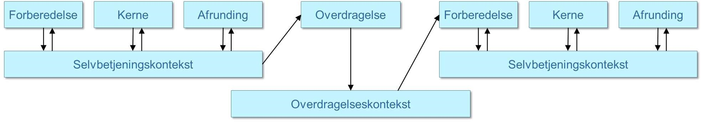

Figur 11: Overdragelse er den del af selvbetjeningsforløb, som faciliterer en sammenkædning mellem to selvbetjeningsforløb, så dette sker forståeligt og operationelt for brugeren. Overdragelseskonteksten er den del af selvbetjeningskonteksten for det første selvbetjeningsforløb, der giver mening at genbruge i den efterfølgende selvbetjeningsløsning. Kilde: Referencearkitektur for selvbetjening.

”Overdragelseskonteksten” kan falde i to kategorier:

* _Procesdata,_ der er data som opsamles eller dannes i et selvbetjeningsforløb og som ikke skal afleveres til et fagsystem, men som ved genbrug kan anvendes til at personalisere selvbetjeningsforløbet.
* _Kernedata,_ der er data, der indgår i selve selvbetjeningsløsningens kerne, som er data der skal ”fanges” og afleveres til et fagsystem og som ved genbrug potentielt kan spare brugeren for indtastninger.[\[45\]](#Fodnote45)

Procesdata kan en selvbetjeningsløsning anvende til at personalisere selvbetjeningsforløbet i den modtagende løsning, da man ud fra kendskab til den forretnings- og procesmæssige kontekst er bedre rustet til at skabe en sammenhængende oplevelse for brugeren. Procesdata kan fx rumme information om sprogvalg, som man derfor ikke behøver udføre igen i den modtagende løsnings forberedelsesfase. Procesdata kan også rumme information om, hvilket selvbetjenings- eller brugerrejseguideforløb brugeren netop har gennemført, hvilke valg der blev truffet undervejs i dette forløb samt resultatet. Den modtagende selvbetjeningsløsning kan fx bruge denne viden til at lede brugeren ind i en forventet variant af selvbetjeningsforløbet, der hænger sammen med det forløb, brugeren har gennemført forud. Dette er fx meget relevant i forhold til en guide, der ved at få procesdata tilbage fra en selvbetjening kan opdatere guideforløbet, fx med status på gennemførte aktiviteter.

Personalisering kan også ske på baggrund af indtastede data (kernedata), fx kan den valgte branche ved registrering af en ny virksomhed anvendes til at tilpasse en oversigt over hvilke andre selvbetjeningsløsninger, der kan være relevante at anvende for den pågældende bruger i forbindelse med, at vedkommende etablerer ny virksomhed.

Hvis man anvender Overdragelse til at udfylde felter i modtagende løsnings kerne (dvs. til ”once only” ift. kernedata) skal man være særligt opmærksom på mulige faldgruber særligt i forhold til datakvalitet. Som hovedprincip kan kernedata kun valideres af autoritative kilder eller af borgeren/virksomheden, der afgiver dem. Der kan også være en risiko for at de ændres (af andre brugere/løsninger) i det tidsrum der går fra, at de afsendes fra den afgivende selvbetjeningsløsning og til de anvendes af den modtagende selvbetjeningsløsning. Det vil derfor normalt være bedre at hente data fra en officiel, verificeret datakilde, da overdragelsesdata generelt set vil være mindre validerede og kvaliteten i højere grad uvis.

Men i bestemte, på forhånd definerede procesforløb kan overdragelseskonteksten være relevant at bringe i spil. Kernedata kan for eksempel udnyttes til at forudfylde inputfelter i den modtagende løsning, der efterlades redigerbare til brugeren. På den måde spares brugeren for genindtastning af identiske data. Det skal være klart og aftalt mellem de involverede myndigheder hvilken myndighed, der er ansvarlig for at kernedata er korrekte på anvendelsestidspunktet (se også afsnit 4.2.1).

### Diskussionen om forretningsmæssig brug af Overdragelse

Overdragelse er den sidste del af et selvbetjeningsforløb efter Forberedelsen, Kernen og Afrundingen. Det er først, når selvbetjeningsforløbet ses i sammenhæng med andre selvbetjeningsforløb, at Overdragelse giver mening, jf. den prikkede kasse i Figur 10.

Sat på spidsen betyder dette, at et projekt – hvis man vælger at forholde sig til Overdragelse – kigger ud over det isolerede forretningsbehov, som det enkelte selvbetjeningsforløb skal håndtere. Med Overdragelse kan man – for at understøtte en tværgående brugerrejse og forbedre brugeroplevelsen – ”række en hånd” til andre selvbetjeningsforløb, hvor det typisk vil være det efterfølgende forløb, der ”høster gevinsten” i form af at skabe en løsning, der trækker på overdragelseskonteksten og derigennem giver en bedre brugeroplevelse. Dette gælder i princippet uanset om der er tale om lineære eller ikke lineære brugerrejser, men særligt hvor der er en mere eller mindre fast (lineær) rækkefølge i forhold til de forløb der indgår.

I sådanne situationer kan det være vigtigt at håndtere den såkaldte ”høste-så-problematik”, der her fx kan dække over, at den foranliggende selvbetjeningsløsning må investere i at implementere videregivelse af overdragelseskonteksten uden selv at høste noget af gevinsten. Hvis det efterfølgende selvbetjeningsforløb oven i købet ligger hos en anden myndighed, understreger det udfordringen yderligere.

Udfordringen kan imødegås ved, at _projektfinansiering tager det tværgående procesperspektiv med i betragtning_. Dermed vil et projekts scope naturligt indeholde understøttelse af Overdragelse, da der er en kendt, efterliggende selvbetjeningsløsning, der har gavn af en overdragelseskontekst. En vigtig pointe er netop, at den efterliggende løsning er kendt, og det dermed er muligt at _designe en specifik overdragelseskontekst_. Denne afhænger både af indholdet i den foranliggende selvbetjeningsløsnings selvbetjeningskontekst og behovet i den efterliggende selvbetjeningsløsning.

Hvis der ikke er et kendt, efterliggende selvbetjeningsforløb, er det i sagens natur vanskeligt at designe et selvbetjeningsforløb til at understøtte overdragelse, da man kun kan gisne om, hvilket databehov et fremtidig, efterliggende selvbetjeningsforløb vil have.

Der er dog fortsat noget, man i et projekt kan gøre for at understøtte fremtidige overdragelsesbehov. For det første kan man tage med som et _designprincip_ i projektet, at man skal holde sig mulige, fremtidige overdragelsesbehov in mente. I praksis kan det fx influere på designet af selvbetjeningsløsningens datamodel. Holder man sig her til eksempelvis kendte _domænestandarder for datamodel og dataformater_, vil det alt andet lige være nemmere at ”åbne” løsningen for Overdragelse senere hen. Med hensyn til domænestandarder anbefales det at projektet rådfører sig med forretningsarkitekter med kendskab til de forvaltningsdomæner, som løsningen omfatter.

Overordnet set kan man anlægge to perspektiver på Overdragelse: _Top down_, hhv. _bottom up_.

_Top down-perspektivet_ er fx repræsenteret i mønsteret ’Sammenhængende guide’ (Bilag B, mønster nr. 6). Her er der et klart formål med, at to underliggende selvbetjeningsforløb skal tale sammen; nemlig, at de indgår i samme overordnede, tværgående proces. Dette giver klare rammer for at designe overdragelseskonteksten, ligesom der er et naturligt sted at forankre kommunikationen med brugeren, fejlhåndtering m.m.

_Bottom up-perspektivet_, derimod, kan ses som et forsøg på at gøre den enkelte selvbetjeningsløsning i stand til at indgå i en lang række kendte og ukendte anvendelser ved at implementere ”generisk Overdragelse”. Komplikationerne ved dette kan imidlertid være så omfattende, hovedsageligt på grund af øget kompleksitet, at ulemperne langt overstiger fordelene.

Denne vejledning anbefaler, at projekter overvejer at implementere understøttelse af Overdragelse, hvis der er et kendt og fornuftigt top down-scenarie, der kan understøttes. Derimod anbefales det ikke at implementere understøttelse af generisk overdragelse jf. bottom up-perspektivet.

Det er også værd at nævne, at Overdragelse i modsætning til Once only endnu ikke er et bredt anvendt mønster. Yderligere brug og erfaringer vil naturligvis kunne kvalificere de mønstre og de anbefalinger, som denne vejledning præsenterer.

#### ”Overdragelsesparathed” øger kompleksitet

At gå efter at anvende en overdragelseskontekst modtaget fra et forud gennemført selvbetjeningsforløb kræver ekstra opmærksomhed i designet af den modtagende løsning. Den modtagende selvbetjeningsløsning skal så at sige være ”overdragelsesparat”.

_Plus/minus overdragelse_: Til en start skal den modtagende selvbetjeningsløsning kunne håndtere, at overdragelseskonteksten måske ikke findes. Brugeren kunne jo være startet op direkte i selvbetjeningsløsningen uden at have gennemført et andet selvbetjeningsforløb forud. Løsningen skal kunne håndtere begge situationer.

_Manipulation og angreb:_ Derudover er der behov for særlig omhu i at validere de data, der modtages i overdragelseskonteksten. Afhængigt af, hvordan overdragelse er implementeret, kan det være muligt for en bruger at manipulere med data. Overdragelse kan fx baseres på URL-parametre eller cookies, der begge kan manipuleres af en kyndig bruger – se kapitel 4 for yderligere diskussion. Da dette kan give en sikkerhedsmæssig angrebsvektor (sårbarhed), er det nødvendigt at have helt klare valideringsregler for, hvordan data modtaget i en overdragelseskontekst skal se ud, samt at håndhæve dette meget stringent.

_Tid og aktualitet_: En anden form for validering er den tidsmæssige. Nogle mønstre for overdragelse kan medføre, at der kan gå lang tid fra, at det forudgående selvbetjeningsforløb afsluttes, til det modtagende selvbetjeningsforløb startes. Det medfører en risiko for, at data i overdragelseskonteksten i mellemtiden mister deres aktualitet og dermed bliver irrelevante. Det må vurderes i den konkrete situation, hvad de tidsmæssige kriterier for genbrug af data fra overdragelseskonteksten er, og hvordan ansvaret håndteres aftalemæssigt.

_Mange varianter af tværgående forløb_: Endelig kan nogle selvbetjeningsforløb være af en karakter, der gør, at de potentielt set kan indgå i en lang række tværgående forløb, hvorved der kan være en række andre selvbetjeningsforløb, der potentielt set kan ligge forud for den selvbetjeningsløsning, som projektet designer. Dermed bliver det yderligere vanskeligt og komplekst at implementere overdragelse, da der nu ikke kun er én, men en række mulige overdragelseskontekster, der skal håndteres, og de kan være forskellige for de forskellige, forudliggende selvbetjeningsløsninger.

_Dokumentation af en selvbetjeningsløsnings understøttelse af overdragels_e: Det er vigtigt at dokumentationen af en selvbetjeningsløsning omfatter, hvordan den kan understøtte overdragelse, og i hvilke forretningsmæssige sammenhænge dette kan ske – både som afgivende og modtagende løsning i en eller flere forløbskæder. Rammer og begrænsninger bør beskrives tydeligt, herunder valgte implementeringsmønstre og hvordan man konkret indgår aftaler om overdragelse.

Sammenfattende må det slås fast, at understøttelse af overdragelsesparathed har en risiko for at øge kompleksiteten i design og implementering af en selvbetjeningsløsning markant. Der kan være situationer, hvor det giver mening og hvor man kan kontrollere kompleksiteten. Fx i forhold til sammenhængen mellem to specifikke, kendte selvbetjeningsforløb, som projektet ved ofte udføres i forlængelse af hinanden, og som måske endda ligger inden for samme myndighed, hvilket alt andet lige begrænser kompleksitetsforøgelsen. Men det kan ikke anbefales at sigte mod en generisk understøttelse af at kunne modtage og genbruge data via en overdragelseskontekst

## Bilag A: Eksempel på praktisk anvendelse af denne vejledning

Dette bilag har til formål at give et eksempel på, hvordan man kan anvende Vejledning i genbrug af data i selvbetjeningsløsninger i en konkret (men fiktiv) projektsammenhæng.

Eksemplet er opfundet til lejligheden[\[46\]](#Fodnote46), og det skal understreges, at løsningsskitser og diagrammer i dette afsnit ikke på nogen måde hævder at repræsentere den virkelige proces.

Eksemplet tager udgangspunkt i brugerrejsen ”jagttegns-aspirant under 18 år ønsker at tilmelde sig jagtprøve”. Projektet har et ønske om at bygge en selvbetjeningsløsning, der understøtter denne brugerrejse, og har indledningsvist identificeret og skitseret nogle af de nødvendige procestrin og forretningsfunktioner, der skal understøtte løsningen (som vist på Figur 12).

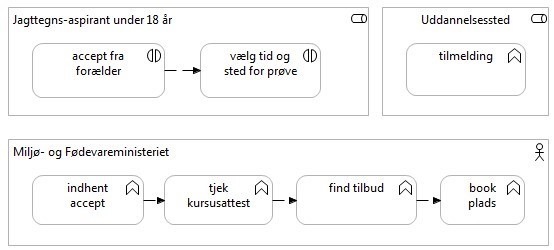

Figur 12: Indledende skitse til procestrin og funktionalitet i en (fiktiv) selvbetjeningsløsning, der gør det muligt for jagttegns-aspiranter under 18 år at tilmelde sig jagtprøve.

Projektet ønsker nu at anvende Vejledning i genbrug af data i selvbetjeningsløsninger for at kunne arbejde ud fra en fast metode i at analysere løsningens databehov og de datakilder, der kan levere den påkrævede data. I denne sammenhæng vælger projektet at gå frem på følgende måde:

* **Analyser databehov:** Projektet finder frem til, at følgende datatyper er påkrævet:
  * CPR-data (om aspirant)
  * CVR-data (om kursusudbydere)
  * Forælder-accept (af at mindreårig ansøger om jagttegn)
  * Kursusresultat (fra forberedende forløb)
  * Godkendte udbydere af jagtprøve
  * Tilmelding til jagtprøve

Projektet har endvidere identificeret de dataansvarlige for de enkelte datasæt og har nu følgende, berigede billede af situationen (Figur 13).

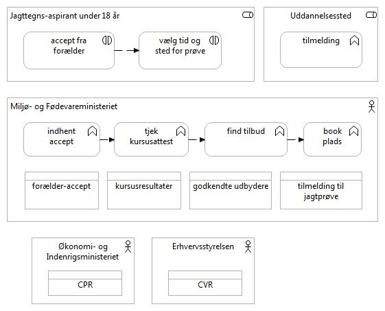

Figur 13: Prøvetilmelding for jagttegn-aspirant under 18 år, nu med identificerede datatyper og dataejere.

* **Identificer datakilder:** Projektet benytter bl.a. det fællesoffentlige datasætkatalog til at finde ud af, hvor de nævnte datatyper kan findes som datakilder. Projektet kommer frem til, at:
  * CPR-data: Kan tilgås på grunddata-datafordeleren hos SDFE
  * CVR-data Er udstillet af Erhvervsstyrelsen
  * Forælder-accept: Kan implementeres i en \[tænkt\] samtykke-database vedligeholdt på borger.dk
  * Kursusresultat: Ligger i en selvstændig datasamling hos Miljøstyrelsen
  * Godkendte udbydere af jagtprøve: Det viser sig, at Undervisningsministeriet vedligeholder et \[tænkt\] index over udbydere af jagtprøver. Ved hjælp af indexet kan konkrete prøvetilbud hentes fra decentrale prøveudbyderes platforme. Det viser sig ved en sammenligning med Miljø- og Fødevarestyrelsens datasæt over godkendte udbydere, at indexet ikke er 100% komplet, da enkelte mindre udbydere mangler. Projektet accepterer datakvaliteten og tager samtidig initiativ til at kommunikere til de pågældende udbydere, at de skal sørge for at få sig registreret, hvis de vil nyde godt af den kommende selvbetjeningsløsning.
  * Tilmelding til jagtprøve: Projektet identificerer, at datasæt med tilmeldinger til jagtprøver ligger decentralt hos de uddannelsessteder, der udbyder jagtprøve.
* **Indgåelse af aftaler:** Projektet benytter tjeklisten fra vejledningens 3.1.5til at sikre, at de relevante aspekter bliver dækket af de enkelte aftaler med datadistributørerne.
  * Som en del af aftalegrundlaget har projektet samtidig analyseret behovet for datatransformationer samt hvor, de skal foretages, og sørger for at få dette skrevet med ind i aftalerne.
* **Relevans af Overdragelse:** Projektet overvejer, om bestilling af jagtprøve passer ind i nogen overordnet brugerrejse. Projektdeltagerne identificerer den overordnede brugerrejse ”Bliv jæger”, der involverer yderligere to potentielle selvbetjeningsforløb:
  * **Gennemfør teoretisk jagtkursus:** Forud for den praktiske jagtprøve skal et teorikursus gennemføres og bestås. Det viser sig dog, at denne proces endnu ikke er fuldt standardiseret og digitaliseret. Derfor giver Overdragelse ikke mening. I stedet kontakter projektet de kursusudbydere, der tilbyder jagttegnsaspiranter en digital prøvekvittering, for at informere dem om den kommende løsning og opfordre dem til at linke til denne i den e-mail, de i dag sender til jagttegnsaspiranten med diplom for bestået teorikursus vedhæftet.
  * **Tilmelding til riffelprøve:** Når den praktiske jagttegnsprøve er gennemført, har aspiranten ret til at gå på hagljagt. En stor procentdel vælger at gå videre med også at tilmelde sig til en riffelprøve, der giver ret til at gå på riffeljagt. Projektet overvejer, hvordan tilmelding til riffelprøve vil kunne kobles til selvbetjeningsløsningen via Overdragelse. Projektdeltagerne kommer frem til, at designet kompliceres af, at det er uddannelsesstederne, der skal indberette resultaterne af den praktiske jagtprøve. Dermed vil en overdragelseskontekst skulle bæres ned forbi uddannelsesstederne for så efterfølgende at vende tilbage til riffelprøveansøgningsforløbet. Der eksisterer i øvrigt endnu ikke et separat riffelprøvetilmeldingsforløb. Projektet bliver enige med sin sponsor om, at selvbetjeningsforløbet for at bestille en praktisk jagtprøve kan udvides til også at omfatte bestilling af riffelprøve, og planlægger dette til en release 1.1 af projektet.

Ud over at benytte Vejledning i genbrug af data i selvbetjeningsløsninger tager projektet også fat i Referencearkitektur for deling af data og dokumenter for at kvalificere sit løsningsdesign omkring de konkrete implementeringer af integration til de identificerede datakilder. Samlet har projektet nu en kvalificeret løsningsskitse (Figur 14), der identificerer de datakilder, der skal genbruges i projektet. Samtidig er løsningen beskrevet ud fra et fællesoffentligt sprog og begrebsapparat, hvilket sikrer mod misforståelser og mindsker risikoen for, at projektet overser vigtige aspekter i designfasen, der ellers kunne føre til forsinkelser eller fordyrelser senere i projektets levetid.

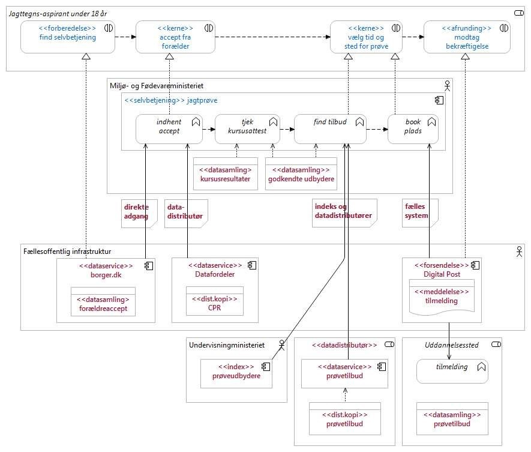

Figur 14: Kvalificeret løsningsskitse for selvbetjeningsforløbet for at tilmelde sig jagtprøve for aspiranter  
under 18 år.

## Bilag B: Mønstre for implementering af Overdragelse

Bilaget supplerer publikationen _Vejledning i genbrug af data i selvbetjeningsløsninger_ med en række forskellige mønstre for overdragelse i sammenhængende selvbetjeningsforløb som indebærer, at brugeren skal anvende mere end en løsning for at klare sit ærinde med det offentlige.

Hvis et projekt, der designer eller videreudvikler et selvbetjeningsforløb, ønsker at implementere Overdragelse til et andet, efterliggende selvbetjeningsforløb, er der en række forskellige mønstre for Overdragelse, der kan være relevante.

Dette bilag gennemgår seks mønstre og diskuterer kort deres fordele og ulemper med henblik på at tjene til inspiration for projektets endelige designvalg. Læseren bør være opmærksom på, at der er tale om eksemplariske mønstre, det ikke nødvendigvis er aftalt at anvende i fællesoffentligt regi.

De seks mønstre er: 1) _Stafet uden data_, 2) _Stafet med data_, 3) _Notifikation med data_, 4) _Notifikation uden data_, 5) _Kontekstlager_, 6) _Sammenhængende guide_.

Nedenstående tabel opridser de seks mønstre. I tabellen, og i dette afsnit generelt, betegner:

* SB1/SB2: Selvbetjeningsløsning 1 (foranliggende), hhv. Selvbetjeningsløsning 2 (modtager af en overdragelseskontekst)
* FS1: Fagsystem 1, relateret til Selvbetjeningsløsning 1
* OK: Overdragelseskontekst
* Kontekstlager: Et system, der har til formål at gemme en kontekst. Er dedikeret til understøttelse af brugerrejser/overdragelse – kan evt. være en procesmotor.

|     |     |     |     |     |     |     |
| --- | --- | --- | --- | --- | --- | --- |Tabel 2: Oversigt og sammenligning af mulige implementeringsmønstre for Overdragelse.
| Mønster | Beskrivelse | Brug af OK | Brug af notifikation | Tidsmæssigt afkoblet | Robust v/ genoptagelse | Mellem parter |
| --- | --- | --- | --- | --- | --- | --- |
| Stafet u/ data | Fuld afslutning af SB1. SB2 henter data efter once only | Nej | Nej | Nej | Nej | Nej |
| Stafet m/ data | OK sendes direkte ind i SB2 fra SB1 | Ja  | Nej | Nej | Nej | Nej |
| Notifikation m/ data | Fagsystem sender notifikation med OK til bruger | Ja  | Ja  | Ja  | Ja  | Ja  |
| Notifikation u/ data | Fagsystem sender notifikation uden OK til bruger | Nej | Ja  | Ja  | Ja  | Ja  |
| Kontekstlager | Ved igangsættelse af SB2 tjekkes for evt. OK gemt af SB1 | Ja  | Nej | Ja  | Ja  | Ja  |
| Sammenhængende guide | Brugercentrisk orkestrering i overordnet guide-løsning | Ja  | Nej | Nej | Ja  | Nej |

Ud over felterne ’Brug af OK’ og ’Brug af notifikation’ rummer Tabel 2 tre kolonner:

* Tidsmæssigt afkoblet: Understøtter mønsteret, at brugerens gennemførsel af SB1 og opstart af SB2 kan ske i separate forløb, som fx kan betyde, at data på grund af forsinkelsen mellem de to forløb ikke længere er aktuelle?
* Robust v/ genoptagelse: Er det muligt for brugeren først at påbegynde SB2 uden at afslutte, og siden hen genoptage SB2 stadig med brug af Overdragelse?
* Mellem parter: En særlig form for Overdragelse går på tværs af forskellige brugere, eksempelvis hvor to forældre begge skal ind over en proces, der angår deres barn. Markeringen her angiver, om det pågældende mønster er egnet til dette.

Nedenfor gennemgås mønstrene enkeltvist.

### Mønster 1: Stafet u/ data

I Figur 1 ses mønsteret for Stafet uden data. ”Stafet” dækker over, at ”stafetten gives videre” mellem de to selvbetjeningsforløb. De indgående trin er:

1. SB1 afgiver data til fagsystemet, som gemmer alle data som en del af Kernen. Data valideres i forbindelse med, at de gemmes, og gøres umiddelbart tilgængelige for SB2 og andre anvendere.
2. SB1 sender brugeren videre til SB2 – direkte i browseren, evt. via link, efter Afrundingen
3. SB2 henter de relevante data fra de underliggende datasæt


Figur 15: Stafet u/ data.

Der er i dette mønster ingen overdragelseskontekst i spil. På den vis kan man sige, at dette mønster er et grundmønster, der giver mulighed for, at SB2 kan genbruge data, men hvor data som en del af SB1 er blevet lagt ned de rigtige steder og dermed kan hentes via ’almindelig’ once-only.

Fordelene i dette mønster er, at det er simpelt, og at der ikke er uverificerede data (i form af overdragelseskonteksten) i spil. Processen er derudover godt afkoblet – brugeren kan vælge at gå videre med forløbet i SB2, og det er samtidig muligt at genoptage SB2 senere.

Aftalemæssigt er det her vigtigt at partnerne er enige om, hvor data lagres og kan hentes til genbrug.

### Mønster 2: Stafet m/ data

Dette mønster rummer blot et enkelt trin:

* SB1 sender ”stafetten” videre til SB2, i form af overdragelseskonteksten, der rummer data, der kan benyttes i SB2. Brugeren fortsætter umiddelbart den overordnede proces i SB2 i samme browser/arbejdsgang.

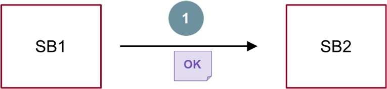

Figur 16: Stafet m/ data.

Teknisk kan dette mønster implementeres med en beriget URL, hvor datafelter fra overdragelseskonteksten angives som parametre. Alternativt kan cookies i browseren bære overdragelseskontekst videre. Sikkerhedsmæssigt er dette dog ikke en optimal løsning og bør ikke benyttes ved følsomme data.

En letvægtsløsning, der kan overføre procesdata i form af, hvilken selvbetjeningsløsning brugeren kommer fra, kan være at benytte et særskilt end-point på SB2-løsningen. Konceptuelt skal SB1 sende brugeren videre til et end-point af formen `https://www.sb2-tld.dk/sb1/`, hvilket fortæller SB2, at brugeren kommer fra SB1. Dette kræver minimal indsats hos SB2 og er også nemt implementeret hos SB1, men kræver naturligvis, at SB1 og SB2 laver en aftale om integrationen, da SB2 nu skal vedligeholde et separat end-point kun af hensyn til SB1.

Fordele ved dette mønster er, at det er simpelt og ikke involverer systemer ud over SB1 og SB2. Ulemper ved mønsteret er, at det ikke er robust. Lukker brugeren browseren ned efter at være sendt videre til SB2, og genoptager brugeren senere SB2-forløbet på ny, er overdragelseskonteksten tabt. SB2 kan dermed ikke længere personalisere løsningen/forudfylde data baseret på overdragelseskonteksten. Brugeren skal selv finde tilbage til SB2 og vil i øvrigt få en anden oplevelse, hvis SB2 startes forfra uden overdragelseskontekst.

### Mønster 3: Notifikation m/ data

I Figur 3 ses et mønster, hvor der introduceres en asynkron notifikation. De indgående trin er:

1. SB1 sender i Kernen sine data inklusive resultat/valg fra selvbetjeningsforløbet til fagsystemet FS1. Data indeholder den overdragelseskontekst, der er relevant for SB2.
2. FS1 kan herefter foretage yderligere processering af data, fx en manuel godkendelse.
3. Når data er færdigprocesseret, sender FS1 en notifikation til brugeren, der indeholder overdragelseskonteksten. Notifikationen kan fx tage form af Digital Post[\[47\]](#Fodnote47), en e-mail eller en SMS.
4. Brugeren agerer på notifikationen og tilgår SB2, fx gennem et beriget link i form af en URL med overdragelseskontekstens data angivet som parametre.

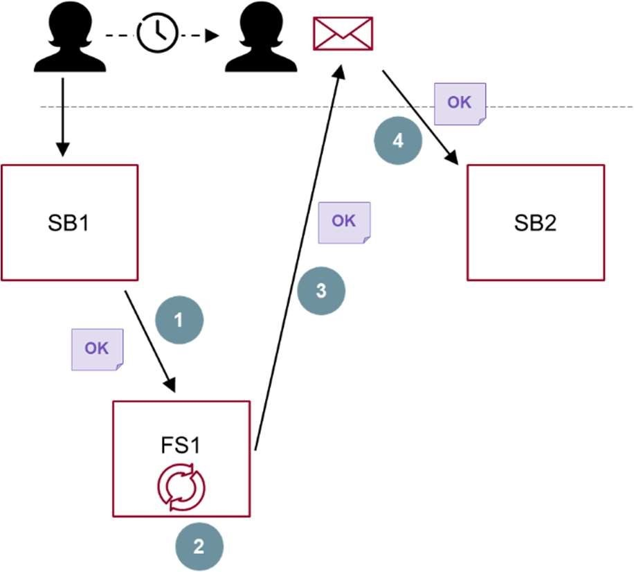

Figur 17: Notifikation med data

Fordelen her er bl.a., at anvendelse af en notifikation gør mønsteret velegnet til at understøtte forløb, hvor en forsinkelse i den tværgående proces ikke kan undgås – med andre ord, hvor det ikke er muligt for brugeren at gennemføre hele processen i én arbejdsgang. Notifikationen gør det nemt at genoptage processen og lade den fortsætte i SB2. Ydermere er genoptagelsen robust – en bruger kan genoptage SB2 flere gange via notifikationen, hver gang med et ensartet forløb og ud fra den samme overdragelseskontekst.

Ulemper ved mønsteret er bl.a., at den tidslige afkobling indebærer en risiko for, at data i overdragelseskonteksten mister deres aktualitet. Der skal i SB2 dermed indføres regler for, hvor længe og under hvilke forudsætninger, man ønsker at stole på data fra overdragelseskonteksten. Ligeledes er mønsteret ikke velegnet, hvis der indgår følsomme data i overdragelseskonteksten.

### Mønster 4: Notifikation u/ data

I lighed med forrige mønster indgår der her en notifikation, men i denne variant bærer notifikationen ingen data/overdragelseskontekst. De indgående trin er:

1. SB1 sender i Kernen sine data inklusive resultat/valg fra selvbetjeningsforløbet til fagsystemet FS1.
2. FS1 kan herefter foretage yderligere processering af data, fx en manuel godkendelse. Når data er færdigprocesseret, gemmes alt data i de relevante datasæt (fx registre), hvorfra de med det samme gøres tilgængelige for genbrug.
3. FS1 sender en ikke-databærende notifikation til brugeren
4. Brugeren benytter link i notifikationen til at tilgå SB2
5. SB2 henter de relevante data, som FS1 har gemt, via once only fra de bagvedliggende datasæt

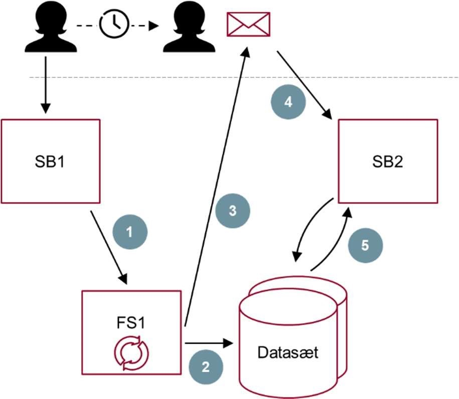

Figur 18: Notifikation uden data

Fordelene i dette mønster er mange. Det understøtter afkobling i tid mellem selvbetjeningsforløb, der indgår i den overordnede, tværgående proces. Notifikationen gør, at SB2 kan genstartes af brugeren. Og det, at SB2 (i lighed med mønster 1) benytter sig af de relevante datasæt direkte og dermed undgår kompleksiteten i at håndtere de uvaliderede og potentielt ikke-aktuelle data i en overdragelseskontekst, mindsker kompleksiteten og mulige fejlkilder.

Ulempen ved mønsteret er, at det ikke understøtter en fuld afvikling af den tværgående proces i én arbejdsgang. Brugeren vil skulle vente på notifikationen, der ankommer ad en separat kanal, før end han/hun meningsfyldt kan tilgå SB2. Tilgår brugeren alligevel SB2, er der en risiko for, at SB2 arbejder ud fra ikke-opdaterede data i de bagvedliggende datasæt, hvis data fx afventer manuel godkendelse i FS1.

### Mønster 5: Kontekstlager

En mulig løsning for at facilitere Overdragelse er at introducere en ny arkitekturkomponent – et Kontekstlager – der har til opgave at holde overdragelseskontekster mellem systemer.

Kontekstlageret kan implementeres i sammenhæng med enten SB1, med SB2 eller som en selvstændig, central komponent, der for den sags skyld kan betjene flere selvbetjeningsløsninger end blot SB1 og SB2.

Trinene i dette mønster er:

1. SB1 gemmer overdragelseskontekst i Kontekstlager
2. Bruger igangsætter efterfølgende SB2. Dette kan enten ske i samme arbejdsgang for brugeren, eller tidsligt afkoblet
3. SB2 forespørger (forud for sin Forberedelsesdel) på Kontekstlageret, om der findes en overdragelseskontekst fra SB1, der hører til den aktuelle bruger. Hvis ja, hentes denne og anvendes i SB2-forløbet.

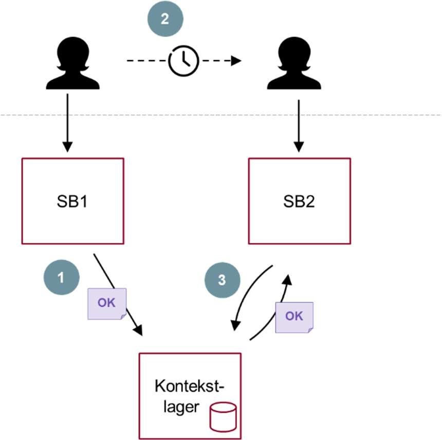

Figur 19: Kontekstlager.

En fordel ved dette mønster er, at det potentielt kan understøtte Overdragelse fra flere forskellige selvbetjeningsløsninger. Dette kan være relevant, hvis SB2 opfylder et specifikt men bredt anvendelige forretningsformål, der indgår som en brik i mere end én tværgående proces. Ulempen ved dette er dog, at det vil bidrage til at øge kompleksiteten i SB2s håndtering af overdragelseskonteksterne, hvor der nu ikke blot skal kvalitetstjekkes på én kontekst, men også implementeres regler for, hvilke foranliggende selvbetjeningsløsninger, der har forrang; i hvilket omfang, flere overdragelseskontekster kan kombineres, m.m.

En anden ulempe er, at den nye komponent i sig selv bidrager til at øge kompleksiteten i systemlandskabet. Det skal derudover aftales mellem SB1 og SB2, hvordan overdragelseskontekster håndteres, herunder hvor længe Kontekstlageret skal opbevare dem, inden de slettes. I forhold til datasikkerhed er der også udfordringer i at lagre data i overdragelseskontekster et nyt sted. GDPR taler fx om, at borgere kan have ret til at få slettet data om dem selv. Hvis personhenførbare data indgår i overdragelseskonteksten og dermed i Kontekstlageret, skal der defineres regler om, hvilket system og hvilken myndighed, der er ansvarlig for at gennemføre en sådan sletning i Kontekstlageret.

### Mønster 6: Sammenhængende guide[\[48\]](#Fodnote48)

Dette mønster dækker over det, man kunne kalde en _top down_\-anvendelse af Overdragelse. Her sigter man mod at implementere en overliggende guide-løsning til at understøtte en brugers tværgående proces/brugerrejse. Som et led i denne guide kan funktionalitet i eksisterende selvbetjeningsløsninger genbruges. Dette gør koordineringen i Overdragelsen langt mere styret, da den så at sige sker oppefra og ned, frem for horisontalt mellem selvbetjeningsløsninger, som tilfældet har været i de forudgående fem mønstre.

De indgående trin i dette mønster, som vist i Figur 6, er:

1. Brugeren anvender en brugercentrisk orkestreringsløsning til at understøtte en tværgående proces. Undervejs i dette orkestreringsforløb (der i sig selv er en selvbetjeningsløsning og indeholder en selvbetjeningskonteskt) sendes brugeren ind SB1, der er en eksisterende selvbetjeningsløsning. I denne sammenhæng dannes den relevante overdragelseskontekst OK1.
2. Den overordnede guide-løsning har, hvor det er muligt og fordelagtigt, mulighed for at trække direkte på forretningsservices udstillet af de relevante, bagvedliggende fagsystemer. Dette kan være hensigtsmæssigt for at skabe det mest brugervenlige forløb, hvor brugeren bliver i den samme løsning (guide-løsningens brugerflade) og ikke skifter ind i en separat selvbetjeningsløsning, der kan have sit eget _look and feel._

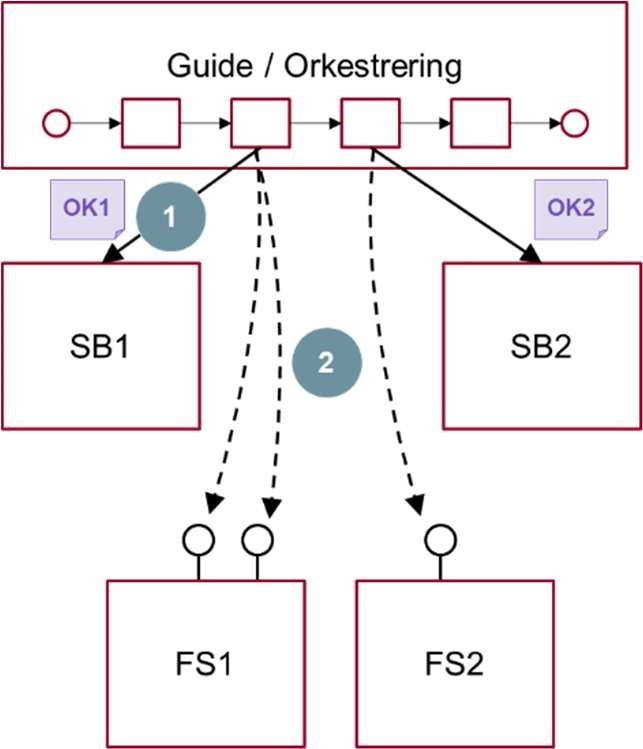

Figur 20: Sammenhængende guide.

Fordelen ved dette mønster er først og fremmest, at det introducerer en separat komponent (guide-løsningen), der har til formål at skabe en god, sammenhængende oplevelse for brugeren på tværs af eksisterende løsninger. Guiden har også mulighed for at sikre, at de overdragelseskontekster, der indgår i forløbet, er aktuelle.

Ulempen er, at mønsteret kræver introduktion af endnu en komponent i form af guide-løsningen, der både skal kunne agere selvbetjeningsløsning samt virke som procesafviklings- og orkestreringsplatform.

En mulig udvidelse af dette mønster er at anvende RPA/robotics-teknologi til automatisk at til at gennemføre fx SB1 i skitsen i Figur 6. Hvis dette gøres serverside, får man mulighed for at pakke SB1-løsningen fuldstændigt ind og effektivt set udstille den som en service, som orkestreringsløsningen kan kalde i forløbet. Det kræver, at guide-løsningen først indsamler alle data fra brugeren, som brugeren ellers ville skulle indtaste i SB1 for at kunne gennemføre SB1-selvbetjeningsforløbet. En ulempe er derudover, at man får skabt en tæt binding til den specifikke version af SB1.

En variant af dette mønster er, at der ikke er tale om en sammenhængende guide med klart defineret start- og sluttilstand, men i stedet tale om en platform/overbliksløsning for løsning af gentagne opgaver, som fx virk.dk er for visse medarbejdere. De underliggende selvbetjeningsforløb (SB1, SB2 m.fl.) vil da kunne notificere (overdrage til) den overordnede platform via fx et Publish/Subscribe-mønster. Ligeledes vil platformen kunne fange forretningshændelser fra fagsystemer m.v. og give brugeren mulighed for at fortsætte eller igangsætte nye selvbetjeningsforløb.

## Fodnoter

\[1\] Link: [Den fællesoffentlige digitaliseringsstrategi 2016-2020](https://digst.dk/strategier/digitaliseringsstrategien/)

\[2\] Link: [Den fællesoffentlige referencearkitektur for selvbetjening](https://arkitektur.digst.dk/referencearkitektur-selvbetjening). Se bl.a. afsnit 6.5 Værdiskabelse

\[3\] Link: [Den fællesoffentlige referencearkitektur for deling af data og dokumenter](https://arkitektur.digst.dk/referencearkitektur-deling-af-data-og-dokumenter-0). Se bl.a. afsnit 2.1 Temaer og afsnit 2.4 Værdiskabelse

\[4\] ’Forretningsudvikler’ dækker også lignende roller som Subject Matter Expert, domæneekspert m.m.

\[5\] Link: [Den fællesoffentlige referencearkitektur for selvbetjening](https://arkitektur.digst.dk/referencearkitektur-selvbetjening)

\[6\] Link: [Fællesoffentlig referencearkitektur for deling af data og dokumenter](https://arkitektur.digst.dk/referencearkitektur-deling-af-data-og-dokumenter-0)

\[7\] Bemærk at du som modtager af kernedata i en overdragelsessammenhæng skal være særligt opmærksom hvilken status de kernedata, du modtager, har, idet manglende validering af data hos den afgivne myndighed kan påvirke kvaliteten af data.

\[8\] Eksemplet er fiktivt.

\[9\] Man kunne yderligere opdele Registreringsdata i hhv. Master data (autoritative data omkring væsentlige forretningsaktiver, brugt på tværs og til flere formål i en organisation) og Transaktionsdata (data relateret til forretningshandlinger,informationsudveksling,m.m.).Beggeundertyperkanvære relevante for genbrug.

\[10\] Juridisk kilde: [Databeskyttelsesforordningen](http://data.europa.eu/eli/reg/2016/679/oj) Juridisk kilde: [Retsinformation: Databeskyttelsesloven](https://www.retsinformation.dk/eli/lta/2018/502) Kilde: [Datatilsynets vejledning om fortegnelse](https:)

\[11\] Kilde: [Retsinformation: Cirkulære om sikkerhedsbeskyttelse af informationer af fælles interesse for landene i NATO eller EU, andre klassificerede informationer samt informatio"ner afsikkerhedsmæssigbeskyttelsesinteresseiøvrigt](https://www.retsinformation.dk/eli/retsinfo/2014/10338)

\[12\] Det kan eksempelvis dreje sig om data, der er generet i en anden kontekst og derfor har eller kan have et semantisk indhold eller har en kvalitet, der afviger fra aftagerens databehov

\[13\] Det er vigtigt, at der i nogle sammenhænge kan være risiko for, at brugerne retter korrekte data, fordi brugerne misforstår data eller fordi data er ufordelagtige for dem.

\[14\] Det kan i øvrigt bemærkes, at visse eksterne datasæt kan være udstillet via en distributionskopi, og at der i den forbindelse kan være forsinkelse på, hvornår en rettelse slår igennem. Se Referencearkitektur for Deling af data og dokumenterforyderligerediskussion afbrugenafdistributionskopier/kopiregistre.

\[15\] Konsekvenserne ved at forhindre en bruger i at gennemføre et selvbetjeningsforløb, fordi en eller flere data ikke kan valideres er beskrevet i ’Fælles krav til digitale løsninger’ under krav nummer 4 ’Feltvalidering’. Du kan finde kravet om feltvalidering i Fælles krav til digitale løsninger, ved at følge dette link: [Krav om feltvalidering som indgår i fælles krav til gode brugeroplevelser](/node/1194#04-feltvalidering-flles-aftalt)

\[16\] I henhold til databeskyttelsesforordningen defineres personoplysninger som _\[…\] enhver form for information om en identificeret eller identificerbar fysisk person (»den registrerede«); ved identificerbar fysisk person forstås en fysisk pe"rson,derdirekteellerindirektekanidentificeres,navnlig ved en identifikator som f.eks. et navn, et identifikationsnummer, lokaliseringsdata, en onlineidentifikator eller et eller flere elementer, der er særlige for denne fysiske persons fysiske, fysiologiske, genetiske, psykiske, økonomiske, kulturelle eller sociale identitet jf._ art. 4, stk. 1.

\[17\] EUROPA-PARLAMENTETS OG RÅDETS FORORDNING (EU) 2018/1807 af 14. november 2018

\[18\] om en ramme for fri udveksling af andre data end personoplysninger i Den Europæiske Union: [Forordning om en ramme for fri udveksling af andre dat"a endpersonoplysningeri DenEuropæiske Union](https://eur-lex.europa.eu/legal-content/DA/TXT/PDF/?uri=CELEX:32018R1807&from=DA)

\[19\] Se databeskyttelsesforordningens art. 6, stk. 4 for nærmere uddybelse.

\[20\] [Datatilsynets vejledning om samtykke](https://www.datatilsynet.dk/Media/0/C/Samtykke%20(3).pdf)

\[21\] Se Datatilsynets oversigt over, hvilke oplysninger der er kategoriseret som følsomme personoplysninger: [Datatilsynet: hvad er personoplysninger](https://www.datatilsynet.dk/hvad-siger-reglerne/grundlaeggende-begreber-/hvad-er-personoplysninger)

\[22\] Databeskyttelsesloven §5, stk. 3: [Databeskyttelseslovens afsnit om behandling af oplysninger](https://www.retsinformation.dk/Forms/R0710.aspx?id=201319#id1ea9ddc4-7017-485c-bb8e-feaee235afdc)

\[23\] Se afsnit 3 i ”Vejledning om de registreredes rettigheder”, hvor kravene i art. 13 og art. 14 om oplysningspligten uddybes af Datatilsynet.

\[24\] Se fx Datafordelerens vilkår her: [Datafordelerens brugervilkår](https://datafordeler.dk/vejledning/brugervilkaar/)

\[25\] Mange kommunale løsninger benytter fx KOMBITs Serviceplatform til integration.

\[26\] Som eksempel anvender sundhedsområdet i bred udstrækning internationale standarder for udveksling af sundhedsrelaterede data.

\[27\] JavaScript Object Notation er et letvægtsformat for at gemme og transportere data. Se fx [www.json.org](http://www.json.org)

\[29\] Det kan også være økonomisk fordelagtigt for en anvender at benytte opslag fra en lokal kopi.

\[30\] Se Referencearkitektur for Deling af Data og Dokumenter for yderligere diskussion, jf. afsnit 2.5.

\[31\] UX = User eXperience

\[32\] Hvis det er relevant og muligt at kunne ændre autoritative data bør det ske ved kilden og man bør naturligvis henvise brugeren til, hvor dette kan ske. Jf. tidligere afsnit kan dette eventuelt implementeres via et API til kilderegister

\[33\] ”Brugere skal have sikkerhed for, at den præsenterede information er korrekt, og der skal være klare regler for, hvad brugeren skal gøre, hvis informationen ikke vurderes at være korrekt.” Kilde: Referencearkitektur for Selvbetjening,side25

\[34\] Overdragelse behandles udførligt i kapitel 4 som er suppleret med en række overdragelsesmønstre i bilag B.

\[37\] Link: [Virks datahub - søgeside](https://datacvr.virk.dk/)

\[38\] Link: [Virk-data - inspiration til åbne offentlige data](https://data.virk.dk/inspiration/Inspiration_aabne_offentlige_data)

\[40\] Link: [Geodatastyrelsen](https://www.geodata-info.dk/)

\[41\] Link: [Open Data DK - Åbne data til dig](http://www.opendata.dk/)

\[42\] Link: [Sundhedsdatastyrelsens - registre og services](https://sundhedsdatastyrelsen.dk/da/registre-og-services)

\[43\] Link: [Statens arkiver - DAISY](https://www.sa.dk/daisy/)

\[44\] Dette designmønster er relateret til det kryptografiske begreb ’zero knowledge proof’, for så vidt at dataanvenderen får dækket sit behov for svar uden, så at sige, at kende mellemregningerne og de data, der indgår heri. [Wikipedia-artikel om Zero-knowledge proof](https://en.wikipedia.org/wiki/Zero-knowledge_proof)

\[45\] Når en myndighed i sin selvbetjeningsløsning har modtaget kernedata, som er overdraget fra en anden selvbetjeningsløsning, er det i lighed med situationer, hvor brugeren selv har indtastet data, vigtigt, at myndigheden sikrer sig, at data er aftilstrækkeligekvalitetfx vedatforetagevalidering i eget fagsystem eller eksterne registre.

\[46\] Delvist genbrugt fra Referencearkitektur for deling af data og dokumenter, DIGST, 2018.

\[47\] Der gælder en række retningslinjer for anvendelse af hyperlinks i Digital Post, som kan læses i Vejledning til Næste generation Digial Post. Vejledningen findes per juni 2019 som i en beta-version på digitaliser.dk. Ifølge vejledningen ”kan \[hyperlinks\] anvendes i meddelelser som adgangsveje til eksterne websteder, eksempelvis selvbetjeningsløsninger. Hyperlinks skal anvende HTTPS-forbindelse, må ikke fremstå som URLforkortere, men skal tydeligt fremstå som en direkte vej til et separat, eksternt website. Afsender skal bevare kontrollen over det website, der linkes til. Baggrunden for dette er hensyn til dels brugervenlighed, dels sikkerhed. Hvis en modtager aktiverer et link i en mail modtaget måske langt tilbage i tiden, vil modtageren risikere enten at besøge et ikke-funktionelt website, eller en ondsindet aktør vil have kunnet overtaget/registreret websitets adresse og dermed præsentere ondsindet indhold på websitet, som kunne hentes ved modtagerens besøg. Det skal herudover bemærkes, at det ikke er tilladt at inkludere personhenførbare data – eksempelvis CPR/CVR-nummer, telefonnummer eller navn – i selve URL/linket. Dette anbefales for at sikre, at personhenførbare oplysninger ikke bliver givet til tredjeparter”.

\[48\] Bemærk at der jf. afsnittet ‘Om denne version’ i selve vejledningen ikke indgår dataunderstøttelse af de 11 borgerrettede guides, som det i Digitaliseringspagten er aftalt at udvikle.
